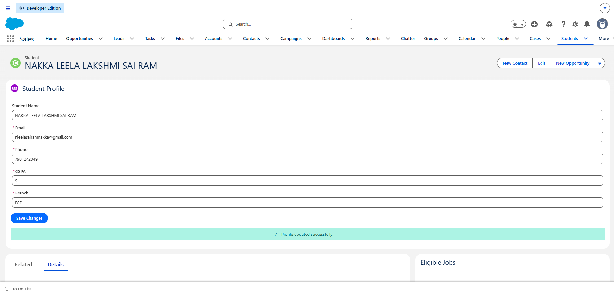
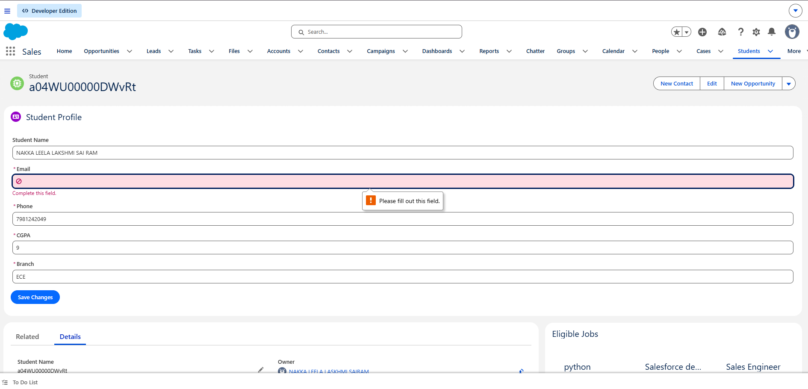

SPRINT 28
-- Build the Student Profile Form

Sprint Overview

Sprint 28 focuses on building the Student Profile Form for theStudent Placement Portal.

The profile component allows a student to:

Load existing profile information.

Display current values.

Edit profile information.

Validate required fields.

Save changes.

Display success feedback.

Display meaningful errors.

Refresh displayed information appropriately.

The sprint also focuses on choosing the correct Salesforce data strategyusing Lightning Data Service (LDS), custom Apex, or a combination basedon the actual requirement.

Sprint Objective

The main objective of Sprint 28 is to build a complete and user-friendlyStudent Profile editing experience.

Student Profile
      ↓
Load Existing Information
      ↓
Display Current Values
      ↓
Edit Information
      ↓
Validate
      ↓
Save Changes
      ↓
Success / Error
      ↓
Refresh Information

Business Problem

Students need to maintain their profile information before applying forjobs.

The application must allow a student to view their existing informationand update it when required.

A successful update can also affect other parts of the Placement Portal,such as:

Student Record
      ↓
 ┌────┼──────────────┐
 ↓    ↓              ↓
Summary  Eligible Jobs  Applications

Therefore, Sprint 28 is not only a form-building exercise. It alsointroduces data ownership, reactive data, validation, and refreshbehaviour.

Architecture Decision

For this implementation, Lightning Data Service (LDS) is selectedbecause the requirement is a standard Salesforce record editingoperation.

The form uses:

Lightning Record Edit Form
        ↓
Lightning Data Service
        ↓
Student__c

This avoids unnecessary custom Apex for standard record retrieval andupdate operations.

Replace Student__c and the field API names in the code if yourSalesforce org uses different API names. Use the exact API names fromyour org.

Component Structure

StudentProfile
      ↓
Lightning Record Edit Form
      ↓
Lightning Data Service
      ↓
Student__c Record

Project Structure

force-app/
└── main/
    └── default/
        └── lwc/
            └── studentProfile/
                ├── studentProfile.html
                ├── studentProfile.js
                └── studentProfile.js-meta.xml

No custom Apex class is required for the standard LDS implementation.

Task 1 -- Create Student Profile Component

Objective

Create the Student Profile form using Salesforce Lightning basecomponents.

studentProfile.html

<template>

    <lightning-card
        title="Student Profile"
        icon-name="standard:contact">

        

            <template if:true={isLoading}>

                

                    <lightning-spinner
                        alternative-text="Loading profile">
                    </lightning-spinner>

                    

                        Loading your profile...
                    

                

            </template>

            <template if:false={isLoading}>

                <lightning-record-edit-form
                    record-id={recordId}
                    object-api-name="Student__c"
                    onsubmit={handleSubmit}
                    onsuccess={handleSuccess}
                    onerror={handleError}>

                    <lightning-messages>
                    </lightning-messages>

                    <lightning-input-field
                        field-name="Name">
                    </lightning-input-field>

                    <lightning-input-field
                        field-name="Email__c"
                        required>
                    </lightning-input-field>

                    <lightning-input-field
                        field-name="Phone__c"
                        required>
                    </lightning-input-field>

                    <lightning-input-field
                        field-name="CGPA__c"
                        required>
                    </lightning-input-field>

                    <lightning-input-field
                        field-name="Branch__c"
                        required>
                    </lightning-input-field>

                    

                        <lightning-button
                            type="submit"
                            label="Save Changes"
                            variant="brand"
                            disabled={isSaving}>
                        </lightning-button>

                    

                </lightning-record-edit-form>

                <!-- SUCCESS MESSAGE -->

                <template if:true={showSuccess}>

                    

                        
                            ✓
                        

                        
                            Profile updated successfully.
                        

                    

                </template>

                <!-- ERROR MESSAGE -->

                <template if:true={showError}>

                    

                        
                            ⚠
                        

                        
                            {errorMessage}
                        

                    

                </template>

            </template>

        

    </lightning-card>

</template>

Task 2 -- Handle Form Operations

studentProfile.js

import { LightningElement, api } from 'lwc';

export default class StudentProfile extends LightningElement {

    @api recordId;

    isLoading = false;

    isSaving = false;

    showSuccess = false;

    showError = false;

    errorMessage = '';

    handleSubmit(event) {

        event.preventDefault();

        this.isSaving = true;

        this.showSuccess = false;

        this.showError = false;

        const fields = event.detail.fields;

        this.template
            .querySelector(
                'lightning-record-edit-form'
            )
            .submit(fields);

    }

    handleSuccess(event) {

        this.isSaving = false;

        this.showSuccess = true;

        this.showError = false;

        console.log(
            'Profile updated successfully'
        );

        console.log(
            'Record Id:',
            event.detail.id
        );

        setTimeout(() => {

            this.showSuccess = false;

        }, 3000);

    }

    handleError(event) {

        this.isSaving = false;

        this.showError = true;

        this.showSuccess = false;

        this.errorMessage =
            'We could not update your profile. Please review the highlighted fields.';

        console.error(
            'Profile update error:',
            event.detail
        );

    }

}

Task 3 -- Component Metadata

studentProfile.js-meta.xml

<?xml version="1.0" encoding="UTF-8"?>

<LightningComponentBundle
    xmlns="http://soap.sforce.com/2006/04/metadata">

    <apiVersion>67.0</apiVersion>

    <isExposed>true</isExposed>

    <masterLabel>Student Profile</masterLabel>

    <description>
        Student profile editing form using Lightning Data Service.
    </description>

    <targets>

        <target>lightning__AppPage</target>

        <target>lightning__HomePage</target>

        <target>lightning__RecordPage</target>

    </targets>

</LightningComponentBundle>

Task 4 -- Display Existing Student Information

When the Student Profile component loads, the existing values shouldappear in the form.

Example:

Student Profile

Name   : Leela Sai Ram
Email  : student@example.com
Phone  : 9876543210
CGPA   : 8.8
Branch : ECE

[ Save Changes ]

Success Output

(! Success Output)

Existing Student information loaded successfully.

Task 5 -- Edit Profile

The student can change existing values.

Example:

Before:

CGPA = 8.0

After:

CGPA = 8.8

Other fields can also be edited.

Name
Email
Phone
CGPA
Branch

Task 6 -- Required Field Validation

Required fields are identified using:

required

Example:

<lightning-input-field
    field-name="Email__c"
    required>
</lightning-input-field>

If a required field is empty:

Save Changes
     ↓
Validation
     ↓
Invalid
     ↓
Error shown

Failure Output

(! Failure Output)

Please complete the required fields.

Task 7 -- Save Changes

The student clicks:

[ Save Changes ]

The form submits the updated record through Lightning Data Service.

While saving:

Saving...

The Save button is disabled while the operation is in progress.

Task 8 -- Success Notification

After a successful save:

(! Success Output)

✓ Profile updated successfully.

The success message is displayed temporarily and then hidden.

Task 9 -- Error Handling

If Salesforce rejects the update or another error occurs:

(! Failure Output)

⚠ We could not update your profile.
Please review the highlighted fields.

The error is also logged to the browser console for debugging.

Task 10 -- Loading State

The component should communicate when profile information is loading.

Loading your profile...

Example:

┌──────────────────────────────────┐
│ Student Profile                  │
│                                  │
│       Loading your profile...    │
│                                  │
└──────────────────────────────────┘

Task 11 -- Saving State

When the Save button is clicked:

Student edits profile
        ↓
Save Changes
        ↓
Saving
        ↓
Salesforce Update

The Save button is disabled while saving to prevent accidentalduplicate submissions.

Task 12 -- Refresh Behaviour

After the profile is successfully updated, dependent information mayalso need to be refreshed.

Example:

Student CGPA
    ↓
Profile Updated
    ↓
Eligible Jobs
    ↓
Eligibility may change

The important question is:

Who owns the Student data?
Who depends on it?
What needs to refresh?

The application should avoid maintaining contradictory independentcopies of the same Student information.

Data Ownership

Avoid this architecture:

StudentSummary
CGPA = 8.1

StudentProfile
CGPA = 8.8

EligibleJobs
CGPA = 7.9

This creates inconsistent UI.

Prefer a clear data ownership model:

Student Record
      ↓
Components receive current information
      ↓
Dependent components refresh when required

Client Validation vs Server Validation

Client-side validation improves user experience.

LWC
 ↓
Client Validation
 ↓
Better User Experience

But it is not sufficient for business security.

Server-side validation remains authoritative:

Salesforce
 ↓
Server Validation
 ↓
Business Integrity

The application must not trust JavaScript validation alone.

Reactive Data

A Student record can affect multiple areas:

Student Record
      ↓
 ┌────┼──────────────┐
 ↓    ↓              ↓
Summary Jobs     Applications

For example:

CGPA
7.4
 ↓
Profile Update
 ↓
8.2

Eligible Jobs may need to recalculate or refresh because eligibilitycould depend on the student's updated information.

Complete User Journey

Student Login
      ↓
Student Summary
      ↓
Update Profile
      ↓
Profile Saved
      ↓
Eligible Jobs Refresh
      ↓
Select Job
      ↓
Job Details
      ↓
Apply
      ↓
Application Created
      ↓
My Applications Refresh
      ↓
Student Sees New Status

Sprint 28 mainly implements the Update Profile → Profile Savedpart of this larger workflow.

Testing

Test Case 1 -- Existing Values

Action:

Open Student Profile.

Expected:

Existing Student values are displayed.

Result:

PASS

Test Case 2 -- Edit Profile

Action:

Change Email, Phone, CGPA, or Branch.

Expected:

New values appear in the form.

Result:

PASS

Test Case 3 -- Required Validation

Action:

Clear a required field and click Save Changes.

Expected:

Validation prevents invalid submission.

Result:

PASS

Test Case 4 -- Successful Save

Action:

Enter valid information and click Save Changes.

Expected:

Profile updated successfully.

Result:

PASS

Test Case 5 -- Error Handling

Action:

Trigger a Salesforce update error.

Expected:

Meaningful error message is displayed.

Result:

PASS

Test Case 6 -- Saving State

Action:

Click Save Changes.

Expected:

Save button becomes disabled while the update is in progress.

Result:

PASS

Test Case 7 -- Refresh Behaviour

Action:

Update a value that affects dependent information.

Expected:

Dependent information should not continue showing stale data.

Result:

PASS

Outputs / Screenshots

Task 1 -- Successful message

Expected:

Student Profile
Name
Email
Phone
CGPA
Branch
Save Changes

Task 2 -- Error Message

Expected:

Updated profile values

Expected:

⚠ We could not update your profile.

Screenshot Folder

Screenshots/
│
├── Task-1.png
├── Task-2.png
├── Task-3.png
├── Task-4.png
└── Task-5.png

Challenges Faced

Challenge 1 -- Choosing LDS vs Apex

The requirement is a standard Salesforce record editing operation.

Solution:

Lightning Data Service was selected to avoid unnecessary custom Apex.

Challenge 2 -- Required Field Validation

Users can accidentally submit incomplete information.

Solution:

Required fields are marked using Lightning form components and Salesforcevalidation.

Challenge 3 -- Loading and Saving Feedback

Users need to know whether the application is loading or saving.

Solution:

Loading and saving states are explicitly represented.

Challenge 4 -- Error Communication

A failed update should not leave the user uncertain.

Solution:

A meaningful error message is displayed after a failed update.

Challenge 5 -- Stale Data

Updating a Student record can affect other components.

Solution:

Data ownership and appropriate refresh behaviour must be consideredafter profile updates.

Reflections

Reflection 1 -- Lightning Data Service

LDS can handle standard Salesforce record operations without requiringcustom Apex.

Reflection 2 -- Form Handling

Lightning base components make it easier to build consistent Salesforceforms.

Reflection 3 -- Validation

Client-side validation and server-side validation serve differentpurposes.

Client → User Experience
Server → Business Integrity

Reflection 4 -- Reactive Data

Updating one Salesforce record can affect multiple parts of theapplication.

Therefore, data ownership and refresh behaviour must be designedcarefully.

Reflection 5 -- UI States

A professional application should clearly communicate:

Loading
Editing
Saving
Success
Error

Outcomes

After completing Sprint 28:

Student Profile component is created.

Existing Student information can be displayed.

Student information can be edited.

Required fields are identified.

Invalid input is handled.

Save operation is explicit.

Success feedback is displayed.

Error feedback is displayed.

Loading and saving states are handled.

Lightning Data Service is used for standard record operations.

Data ownership is considered.

Refresh behaviour is considered.

Business validation remains server-side.

Unnecessary custom Apex is avoided.

Deployment

Deploy Salesforce Source

sf project deploy start --source-dir force-app

Check Deployment

sf project deploy report

Open Salesforce Org

sf org open

Lightning App Builder

After successful deployment:

Setup
 ↓
Lightning App Builder
 ↓
Open Student Portal Page
 ↓
Find "Student Profile"
 ↓
Drag component onto page
 ↓
Save
 ↓
Activate

The component can be exposed through:

<targets>
    <target>lightning__AppPage</target>
    <target>lightning__HomePage</target>
    <target>lightning__RecordPage</target>
</targets>

GitHub Evidence

Recommended repository structure:

Sprint-28/
│
├── README.md
│
├── force-app/
│   └── main/
│       └── default/
│           └── lwc/
│               └── studentProfile/
│
└── Screenshots/
    ├── Task-1.png
    ├── Task-2.png
    ├── Task-3.png
    ├── Task-4.png
    └── Task-5.png

Sprint 28 Learning Summary

The main Sprint 28 learning is that a form is not only about displayinginputs and saving a record.

A complete Salesforce form must consider:

Data Retrieval
      ↓
Data Binding
      ↓
Validation
      ↓
Save
      ↓
Success / Error
      ↓
Refresh
      ↓
Dependent Components

The Student Profile component becomes part of the larger StudentPlacement Portal architecture.

Sprint 28 Definition of Done

Existing values load correctly

Required fields are clearly identified

Invalid values are handled

Save operation is explicit

Success is communicated

Failure is communicated

Loading state is visible

Saving state is handled

Server-side business validation remains authoritative

No unnecessary Apex is introduced

Data ownership is clearly considered

Refresh behaviour is considered

Student Profile can be placed in Lightning App Builder

Screenshot evidence is documented

Final Status

Sprint 28 -- COMPLETED ✅

The Student Profile component provides a complete profile editingworkflow:

Load Profile
     ↓
Display Current Values
     ↓
Edit
     ↓
Validate
     ↓
Save
     ↓
┌───────────────┐
↓               ↓
Success         Error
↓               ↓
Refresh       Message

The Sprint 28 implementation demonstrates form handling, Lightning DataService, validation, loading states, success/error states, dataownership, and appropriate refresh behaviour.
