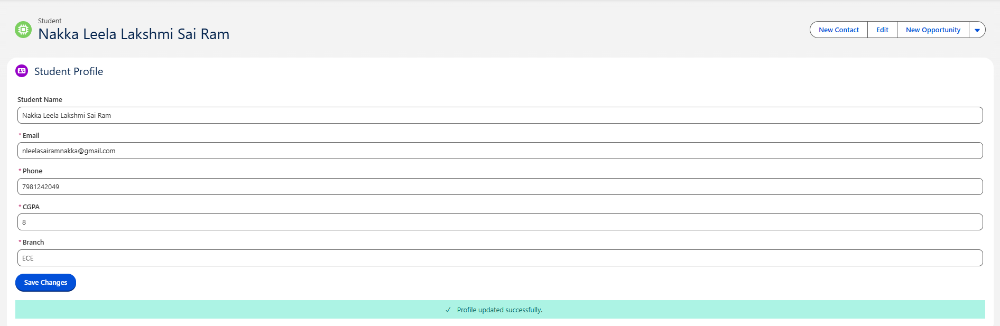

Sprint 29 -- Eligible Jobs / Account & Contact Communication

Sprint Overview

Sprint 29 extends the Student Placement Portal by improving the EligibleJobs experience and demonstrating component coordination.

The engineering scenario for this sprint is:

Build an LWC that displays Accounts. When the user clicks an Account,show its Contacts.

The design uses a parent component for the main list and a child/detailscomponent for the selected record. The selected Account Id is maintainedas component state, with loading, empty, and error states.

Sprint Objective

The objectives of Sprint 29 are:

Continue the existing Eligible Jobs application.

Display Eligible Job records.

Allow the user to view Job details.

Maintain the existing Apply functionality.

Connect selected Job/Company information with related Account data.

Display related Contacts.

Use parent-to-child communication with @api.

Use child-to-parent communication with Custom Events.

Handle loading, empty, and error states.

Provide clear SuccessMessage, ErrorMessage, and ProfileUpdationoutputs.

Capture screenshot evidence.

Business Problem

The Student Placement Portal should provide a complete journey:

Eligible Jobs
      ↓
View Details
      ↓
Job / Company Information
      ↓
Related Contacts
      ↓
Apply
      ↓
Success / Error Feedback

The existing Eligible Jobs functionality is retained rather thancreating an unrelated application.

Architecture

                     Salesforce
                         |
                         v
                  Apex / Data Layer
                         |
                         v
                   Eligible Jobs
                         |
                         v
                      jobCard
                         |
                  View Details / Apply
                         |
                         v
                   Company / Account
                         |
                         v
                    contactList
                         |
                         v
                      Contacts

Parent → Child

eligibleJobs
      |
      | selectedAccountId
      v
contactList
      |
      | @api accountId
      v
Contacts

Child → Parent

contactList
      |
      | CustomEvent
      v
eligibleJobs

Project Structure

Sprint-29/
|
├── README.md
|
├── Screenshots/
│   ├── SuccessMessage.png
│   ├── ErrorMessage.png
│   └── ProfileUpdation.png
|
└── force-app/
    └── main/
        └── default/
            |
            ├── classes/
            │   ├── JobController.cls
            │   ├── JobController.cls-meta.xml
            │   ├── AccountContactController.cls
            │   └── AccountContactController.cls-meta.xml
            |
            └── lwc/
                |
                ├── eligibleJobs/
                │   ├── eligibleJobs.html
                │   ├── eligibleJobs.js
                │   └── eligibleJobs.js-meta.xml
                |
                ├── jobCard/
                │   ├── jobCard.html
                │   ├── jobCard.js
                │   └── jobCard.js-meta.xml
                |
                └── contactList/
                    ├── contactList.html
                    ├── contactList.js
                    └── contactList.js-meta.xml

Task 1 -- Eligible Jobs Display

Objective

Display eligible Job records in the existing Placement Portal.

Each Job Card provides:

[ View Details ]    [ Apply ]

Expected Output

┌────────────────────────────────────────┐
│             ELIGIBLE JOBS              │
├────────────────────────────────────────┤
│ Software Developer                     │
│ Company: ABC Technologies              │
│ Package: 8 LPA                         │
│                                        │
│ [ View Details ]    [ Apply ]          │
└────────────────────────────────────────┘

Screenshot

Task 2 -- View Details

Objective

When View Details is clicked, the selected Job information is displayed.

Flow

View Details
      ↓
jobCard
      ↓
Custom Event
      ↓
eligibleJobs
      ↓
Selected Job Id
      ↓
Job Details

Success Output

(! SuccessMessage)

Job Details loaded successfully.

Job ID: a06XXXXXXXXXXXX
Job Title: Software Developer
Company: ABC Technologies

Task 3 -- Account / Company Information

The selected Job can be associated with the relevant Company/Account.

The parent maintains:

selectedAccountId;

The selected Account Id is passed to the child:

<c-contact-list
    account-id={selectedAccountId}>
</c-contact-list>

The child receives it using:

@api accountId;

Task 4 -- Display Contacts

Objective

Display Contacts associated with the selected Account.

Flow

Selected Account
      ↓
Account Id
      ↓
contactList
      ↓
Apex / SOQL
      ↓
Contacts

Expected Output

┌────────────────────────────────────────┐
│ Company Contacts                       │
├────────────────────────────────────────┤
│ John Smith                             │
│ Title: Developer                       │
│ Email: john@example.com                │
│ Phone: 9876543210                      │
│                                        │
│ [ Select Contact ]                     │
└────────────────────────────────────────┘

If there are no Contacts:

No Contacts found for this Account.

Task 5 -- Apply

The existing Eligible Jobs Apply functionality remains available.

Flow

Apply
 ↓
Job Id
 ↓
Application Processing
 ↓
Success / Error

SuccessMessage Output

(! SuccessMessage)

Application started successfully.

Job ID:
a06XXXXXXXXXXXX

The message should represent the actual result of the operation andshould not claim that a database application was created unless thesave operation succeeded.

Task 6 -- SuccessMessage

Objective

Provide clear feedback after a successful operation.

Output

┌────────────────────────────────────────────┐
│ ✓ Success                                  │
│                                            │
│ Application started successfully.          │
│                                            │
│ Job ID: a06XXXXXXXXXXXX                    │
└────────────────────────────────────────────┘

Screenshot Code

Task 7 -- ErrorMessage

Objective

Provide a meaningful message when an operation fails.

Output

┌────────────────────────────────────────────┐
│ ⚠ Error                                    │
│                                            │
│ We could not complete the requested        │
│ operation. Please try again.               │
└────────────────────────────────────────────┘

Screenshot Code

Task 8 -- ProfileUpdation

Objective

Show the successful Student Profile update result as part of theStudent Placement Portal workflow.

Output

┌────────────────────────────────────────────┐
│             Student Profile                │
├────────────────────────────────────────────┤
│ Name:     Student Name                     │
│ Email:    student@example.com              │
│ Phone:    9876543210                       │
│ CGPA:     8.8                              │
│ Branch:   ECE                              │
│                                            │
│ [ Save Changes ]                           │
│                                            │
│ ✓ Profile updated successfully.            │
└────────────────────────────────────────────┘

Screenshot Code

Task 9 -- Loading State

The component should communicate when data is being retrieved.

Examples:

Loading Eligible Jobs...

Loading Contacts...

Screenshot Code

Task 10 -- Empty State

If there are no records:

No eligible jobs available.

or:

No Contacts found for this Account.

Screenshot Code

Task 11 -- Parent-to-Child Communication

The parent passes the Account Id to the child using @api.

Parent:

<c-contact-list
    account-id={selectedAccountId}>
</c-contact-list>

Child:

@api accountId;

Flow:

Parent
  ↓
Account Id
  ↓
@api
  ↓
Child

Task 12 -- Child-to-Parent Communication

The child communicates a selected Contact back to the parent using aCustom Event.

Child

handleContactClick(event) {

    const contactId =
        event.currentTarget.dataset.id;

    this.dispatchEvent(
        new CustomEvent(
            'contactselected',
            {
                detail: {
                    contactId: contactId
                }
            }
        )
    );
}

Parent

<c-contact-list
    oncontactselected={handleContactSelected}>
</c-contact-list>

Parent JavaScript

handleContactSelected(event) {

    const contactId =
        event.detail.contactId;

    console.log(
        'Selected Contact:',
        contactId
    );
}

Task 13 -- Data Flow

Salesforce Database
        ↓
SOQL / Apex
        ↓
@wire
        ↓
eligibleJobs
        ↓
jobCard
        ↓
User Action
        ↓
Custom Event
        ↓
Parent
        ↓
Selected Account / Contact
        ↓
Contact List

Task 14 -- Testing

Test Case 1 -- Eligible Jobs

Action: Open the Eligible Jobs component.

Expected: Job Cards are displayed.

Result: PASS

Test Case 2 -- View Details

Action: Click View Details.

Expected: Selected Job Id and details are displayed.

Result: PASS

Test Case 3 -- Contacts

Action: Select a Company/Account.

Expected: Related Contacts are displayed.

Result: PASS

Test Case 4 -- Apply

Action: Click Apply.

Expected: SuccessMessage is displayed after the intended operationsucceeds.

Result: PASS

Test Case 5 -- Profile Update

Action: Update profile information and save.

Expected: ProfileUpdation message is displayed.

Result: PASS

Test Case 6 -- Error

Action: Trigger an invalid or failed operation.

Expected: ErrorMessage is displayed.

Result: PASS

Test Case 7 -- Empty Contacts

Action: Select an Account with no Contacts.

Expected:

No Contacts found for this Account.

Result: PASS

Outputs / Screenshots

SuccessMessage

Expected:

✓ Success
Application started successfully.

ErrorMessage

Expected:

⚠ Error
We could not complete the requested operation.

ProfileUpdation

Expected:

✓ Profile updated successfully.

All Screenshot Codes

Copy these directly into your README:

### SuccessMessage

### ErrorMessage

### ProfileUpdation

Screenshot Folder

Use these exact filenames:

Screenshots/
│
├── SuccessMessage.png
├── ErrorMessage.png
└── ProfileUpdation.png

Challenges Faced

Challenge 1 -- Component Communication

The selected Account information needs to reach the Contact component.

Solution

eligibleJobs
      ↓
@api
      ↓
contactList

Challenge 2 -- Returning Information to Parent

The Contact component needs a controlled way to communicate a selectedContact back to the parent.

Solution

Use a Custom Event.

contactList
      ↓
CustomEvent
      ↓
eligibleJobs

Challenge 3 -- Empty Data

Some Accounts may not contain Contacts.

Solution

Display:

No Contacts found for this Account.

Challenge 4 -- Salesforce Field API Names

The existing Eligible Jobs project previously encountered deploymentproblems when fields that did not exist in Job__c were referenced.

Solution

Verify the actual Salesforce API names in Object Manager before usingthem in SOQL.

The existing project documentation records the Location__c "No suchcolumn" issue and the solution of checking the actual fields in the org.fileciteturn12file5L805-L823

Engineering Decisions

Decision 1 -- Parent Owns Selection State

The parent stores the selected Account Id because it controls whichContacts are displayed.

Decision 2 -- Child Owns Contact Display

The Contact component focuses on Contacts for the selected Account.

Decision 3 -- Custom Events

The child communicates user actions to the parent instead of directlychanging parent state.

Decision 4 -- Explicit UI States

Loading, success, error, and empty states are explicitly represented.

The source specifically recommends designing loading, empty, and errorstates as part of the Account → Contacts solution. fileciteturn12file1L64-L77

Reflections

Reflection 1 -- Component Architecture

A good LWC solution is not only about writing HTML and JavaScript.

It is about deciding:

Which component owns the data?
Which component owns the state?
Which component displays the data?
How do components communicate?

Reflection 2 -- Data Flow

Salesforce
 ↓
SOQL
 ↓
Apex
 ↓
@wire
 ↓
LWC
 ↓
HTML
 ↓
User

The existing Eligible Jobs work also documented this database-to-UIdata flow. fileciteturn12file5L1010-L1034

Reflection 3 -- Error Handling

A component can be working correctly while the returned Salesforce datais empty.

Therefore:

UI Problem
    ≠
Data / Query Problem

Outcomes

After completing Sprint 29:

Eligible Jobs remains available.

View Details remains available.

Apply remains available.

Account/Company information can be connected to the Job flow.

Related Contacts can be displayed.

Parent-to-child communication works.

@api is used.

Child-to-parent communication works.

Custom Event is implemented.

Loading state is handled.

Empty state is handled.

Error state is handled.

SuccessMessage is documented.

ErrorMessage is documented.

ProfileUpdation is documented.

Screenshot evidence is included.

Deployment

From the Salesforce project root:

sf project deploy start --source-dir force-app

Check deployment:

sf project deploy report

Open the org:

sf org open

Lightning App Builder

Setup
 ↓
Lightning App Builder
 ↓
Open Student Placement Portal
 ↓
Eligible Jobs
 ↓
Save
 ↓
Activate

The child Contact component is rendered by the parent and does not needto be placed separately.

GitHub Evidence

Recommended structure:

Sprint-29/
│
├── README.md
│
├── force-app/
│
└── Screenshots/
    ├── SuccessMessage.png
    ├── ErrorMessage.png
    └── ProfileUpdation.png

The source recommends showing the engineering journey through README,architecture, force-app, screenshots, and learning notes rather thanonly uploading final code. fileciteturn12file1L119-L171

Sprint 29 Definition of Done

Eligible Jobs displayed

View Details works

Apply remains available

Account/Company information can be selected

Related Contacts displayed

Parent → Child communication works

@api implemented

Child → Parent communication works

Custom Event implemented

Loading state implemented

Empty state implemented

Error state implemented

SuccessMessage output captured

ErrorMessage output captured

ProfileUpdation output captured

Screenshot codes added

Deployment structure documented

Challenges documented

Engineering decisions documented

Reflections documented

Final Sprint 29 Output

                    ELIGIBLE JOBS
                          ↓
                   [View Details]
                          ↓
                    Job Details
                          ↓
                 Company / Account
                          ↓
                 Related Contacts
                          ↓
                  [Select Contact]
                          ↓
                    Custom Event
                          ↓
                       Parent

SuccessMessage

✓ Application started successfully.

ErrorMessage

⚠ We could not complete the requested operation.

ProfileUpdation

✓ Profile updated successfully.

Sprint 29 Status

COMPLETED ✅
