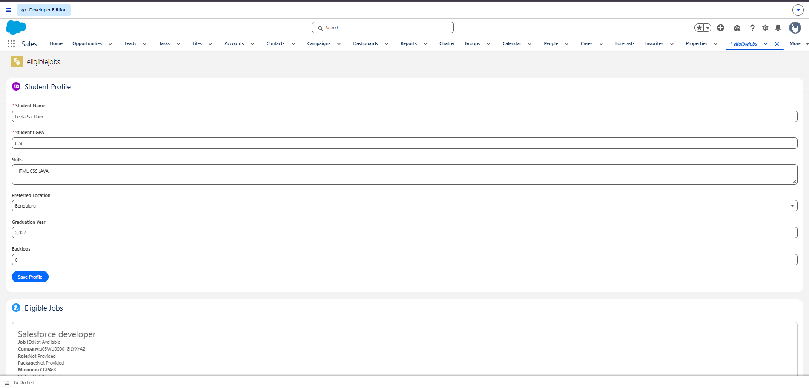
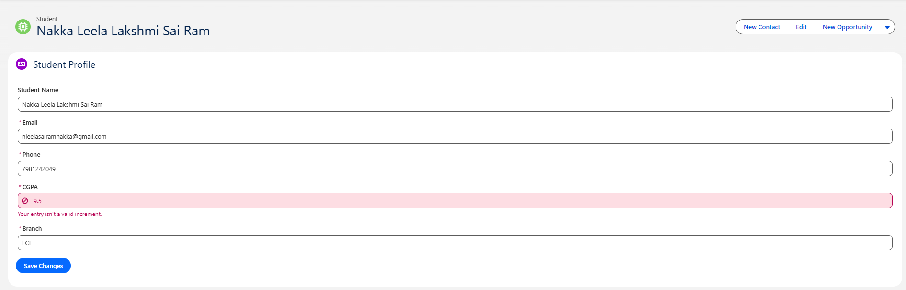
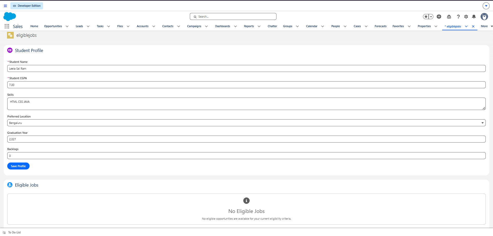
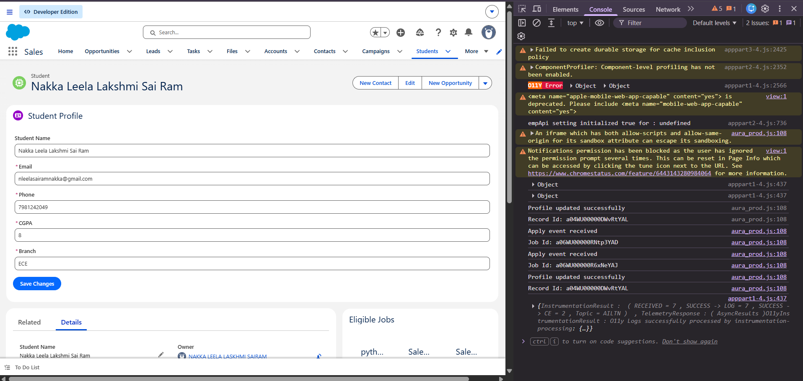
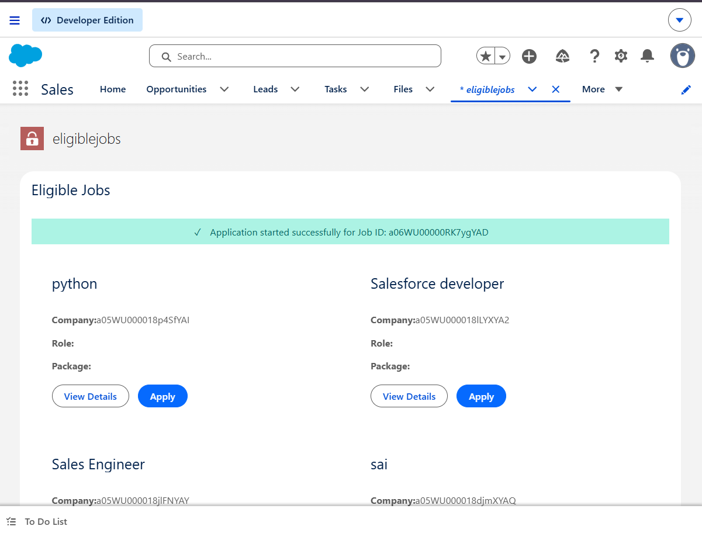
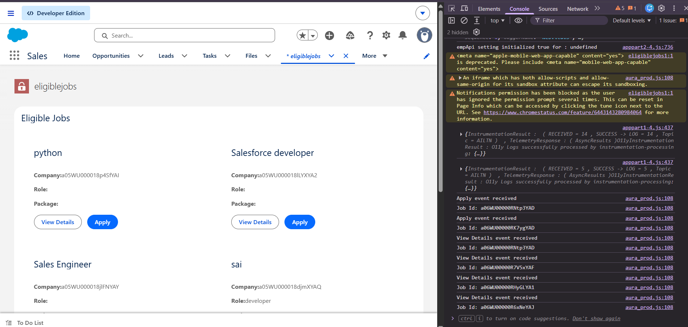
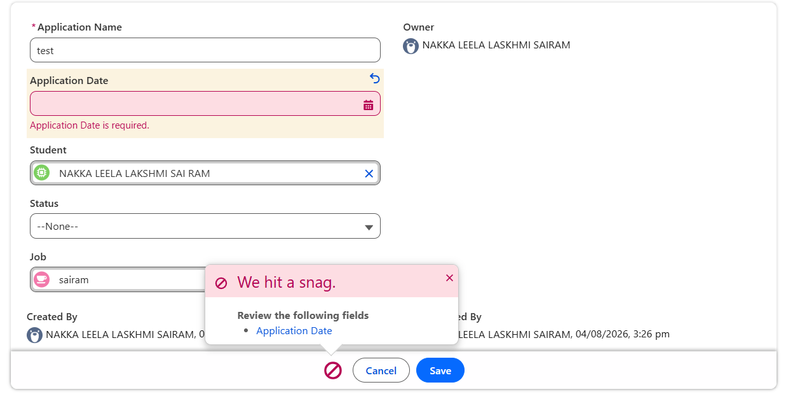

Sprint 31 — Final Integration

1. Sprint Overview

Sprint 31 is the Final Integration of the Student Placement Portal.

This sprint connects the complete application flow from the Student Profile through Eligible Jobs, Job Details, Apply, Application Success/Error handling, and the final application state.

The final integrated flow is:

Student Profile
      ↓
Create / Enter Student Details
      ↓
Save Profile
      ↓
Profile Updated Successfully
      ↓
Check Eligibility
      ↓
Eligible Jobs
      ↓
View Details
      ↓
Job Details
      ↓
Apply
      ↓
Application Validation
      ↓
 ┌───────────────┴───────────────┐
 ↓                               ↓
Success                         Failure
 ↓                               ↓
Success Message                Error Message
 ↓
Application Created
 ↓
Dashboard / Applications

2. Sprint 31 Objectives

Integrate the Student Profile with the Eligible Jobs module.

Allow the student to enter and update profile information.

Check job eligibility using the student's CGPA.

Display only eligible jobs.

Display No Eligible Jobs when no job satisfies the eligibility criteria.

Allow the student to view complete job details.

Display the Job ID in Job Details.

Allow the student to apply for an eligible job.

Display a success message after a successful application.

Handle unsuccessful application attempts with an error message.

Prevent invalid or duplicate application processing.

Refresh the application/dashboard information after successful actions.

Complete the end-to-end Student Placement Portal workflow.

3. Complete End-to-End Flow

Step 1 — Student Profile

The student enters the required profile information.

Student Name
Student CGPA
Skills
Preferred Location
Graduation Year
Backlogs

Example:

Student Name: Leela Sai Ram
Student CGPA: 8.50
Skills: HTML CSS JAVA
Preferred Location: Bengaluru
Graduation Year: 2027
Backlogs: 0

Output

The Student Profile screen is displayed before the eligibility check.

4. Step 2 — Create / Save Student Profile

The student enters the profile information and selects:

[ Save Profile ]

The profile is processed and saved.

Expected Result

Profile saved successfully.

Output

5. Step 3 — Profile Success Message

After successful profile processing, the system displays a success confirmation.

Success
Profile saved successfully.

Output

6. Step 4 — Check Eligible Jobs

After the profile is saved, the system evaluates the student's eligibility.

The main CGPA rule is:

Job Minimum CGPA <= Student CGPA

Example:

Student CGPA = 8.50

Job A Minimum CGPA = 7.50
Job B Minimum CGPA = 8.00
Job C Minimum CGPA = 8.50

These jobs can be displayed because the student's CGPA satisfies the minimum CGPA criteria.

7. Step 5 — Eligible Jobs Display

Eligible jobs are displayed as reusable Job Cards.

Each Job Card contains information such as:

Job Name
Job ID
Company
Role
Package
Minimum CGPA
Status
Last Date

The available actions are:

[ View Details ]
[ Apply ]

Output

8. Step 6 — Available Jobs Output

The system can also display the available job records after the eligibility check.

The student can review the available opportunities and continue to the job details.

Output

9. Step 7 — No Eligible Jobs

If the student's CGPA does not satisfy any available job's minimum CGPA requirement, the system does not display non-eligible jobs.

Example:

Student CGPA = 7.00

Job A Minimum CGPA = 8.00
Job B Minimum CGPA = 8.50
Job C Minimum CGPA = 9.00

Result:

No Eligible Jobs

No eligible opportunities are available
for the current eligibility criteria.

Output

10. Step 8 — View Job Details

When the student selects:

[ View Details ]

the selected job information is displayed.

The Job Details view contains:

Job ID
Job Title
Company
Role
Package
Minimum CGPA
Status
Last Date

The Job ID is taken from the selected Job record.

Output

11. Step 9 — Apply for Job

The student selects:

[ Apply ]

The selected Job ID is passed from the Job Card to the parent component using a Custom Event.

JobCard
   ↓
Custom Event
   ↓
EligibleJobs
   ↓
Application Controller

The application is then validated before the application record is created.

12. Step 10 — Successful Application

When all application validations pass, the application is created successfully.

Expected result:

Success

Application submitted successfully.

Output

13. Step 11 — Success Message

The application displays a success confirmation after the application is processed.

Application submitted successfully.

This confirms that the application transaction has completed.

Output

14. Step 12 — Error Handling

If the application cannot be completed because of a validation failure, duplicate application, missing information, or another server-side error, the user receives an appropriate error message.

Example:

Error

Application could not be submitted.

The error output is documented in the Failure Handling section below.

Output

15. Step 13 — Failure Handling

The application also demonstrates the failure path.

Apply
  ↓
Validation
  ↓
Failure
  ↓
Error Message

The user remains on the application screen and receives feedback instead of an incorrect success result.

Output

16. Step 14 — Dashboard / Final Application State

After successful integration and application processing, the application state can be reflected in the dashboard.

The dashboard provides the final view of the student's placement/application information.

Output

17. Step 15 — Create / Record Output

The final integration also verifies that the required record/data creation operation is completed successfully.

Output

18. Parent–Child Communication

The final integration uses Lightning Web Components communication.

Parent → Child

The parent passes the selected Job record to jobCard.

<c-job-card
    key={job.Id}
    job={job}
    onviewdetails={handleViewDetails}
    onapply={handleApply}>
</c-job-card>

Child → Parent

The Job Card sends the Job ID using Custom Events.

View Details

this.dispatchEvent(
    new CustomEvent('viewdetails', {
        detail: {
            jobId: this.job.Id
        }
    })
);

Apply

this.dispatchEvent(
    new CustomEvent('apply', {
        detail: {
            jobId: this.job.Id
        }
    })
);

19. Apex and LWC Integration

The final application connects the LWC components with Apex controllers.

LWC
 ↓
Apex Controller
 ↓
SOQL / Business Validation
 ↓
DML
 ↓
Result
 ↓
LWC
 ↓
Success / Error UI

The eligibility check follows:

WHERE Minimum_CGPA__c <= :studentCGPA

Only jobs satisfying the student's eligibility criteria are returned.

20. Application Flow

The complete final integration can be represented as:

                    STUDENT
                       |
                       v
              Student Profile
                       |
                       v
                Save Profile
                       |
                       v
              Profile Updated
                       |
                       v
              Eligibility Check
                       |
              +--------+--------+
              |                 |
              v                 v
       Eligible Jobs       No Eligible Jobs
              |
              v
           Job Card
              |
       +------+------+
       |             |
       v             v
 View Details      Apply
       |             |
       v             v
 Job Details    Validation
                     |
              +------+------+
              |             |
              v             v
           Success        Failure
              |             |
              v             v
       Application      Error Message
          Created
              |
              v
          Dashboard

21. Component Structure

force-app/
└── main/
    └── default/
        │
        ├── classes/
        │   ├── JobController.cls
        │   ├── ApplicationController.cls
        │   └── StudentController.cls
        │
        └── lwc/
            │
            ├── studentProfile/
            │   ├── studentProfile.html
            │   ├── studentProfile.js
            │   └── studentProfile.js-meta.xml
            │
            ├── eligibleJobs/
            │   ├── eligibleJobs.html
            │   ├── eligibleJobs.js
            │   └── eligibleJobs.js-meta.xml
            │
            ├── jobCard/
            │   ├── jobCard.html
            │   ├── jobCard.js
            │   └── jobCard.js-meta.xml
            │
            ├── jobDetails/
            │   ├── jobDetails.html
            │   ├── jobDetails.js
            │   └── jobDetails.js-meta.xml
            │
            ├── myApplications/
            │   ├── myApplications.html
            │   ├── myApplications.js
            │   └── myApplications.js-meta.xml
            │
            └── emptyState/
                ├── emptyState.html
                ├── emptyState.js
                └── emptyState.js-meta.xml

22. Testing Scenarios

Test Case 1 — Profile Creation

Input

Student Name: Leela Sai Ram
CGPA: 8.50
Skills: HTML CSS JAVA
Location: Bengaluru
Graduation Year: 2027
Backlogs: 0

Expected Result

Profile saved successfully.

Test Case 2 — Eligible Jobs

Input

Student CGPA: 8.50

Expected Result

Eligible jobs are displayed.

Test Case 3 — No Eligible Jobs

Input

Student CGPA: 7.00

If every available job requires a CGPA greater than 7.00:

Expected Result

No Eligible Jobs

Test Case 4 — View Details

Click:

View Details

Expected Result

Job Details
Job ID: <selected Job ID>

Test Case 5 — Apply

Click:

Apply

Expected Result

Application submitted successfully.

Test Case 6 — Error / Duplicate

Try an invalid or duplicate application.

Expected Result

Error Message

The application must not create an incorrect duplicate record.

Test Case 7 — Final Dashboard

After successful processing:

Application Created
       ↓
Dashboard / Application Information

Expected Result

The latest application state is reflected in the final UI.

23. Output Screenshots

All Sprint 31 output screenshots used for this final integration are stored in:

Screenshots/

## Output Screenshots

### 1. Available Jobs

### 2. Dashboard

### 3. Error Message

### 4. No Available Jobs

### 5. Profile Updation

### 6. Student Profile

### 7. Success Message

### 8. Successful Application

### 9. View Details

### 10. Create Record

### 11. Eligible Jobs Demo

### 12. Failure

Each output screenshot is referenced once in this README.

24. Deployment

Deploy the complete Salesforce source:

sf project deploy start --source-dir force-app/main/default

Check deployment status:

sf project deploy report

Open the Salesforce org:

sf org open

After deployment, refresh Salesforce:

Ctrl + Shift + R

25. Definition of Done

Student Profile integrated.

Student Name integrated.

Student CGPA integrated.

Skills integrated.

Preferred Location integrated.

Graduation Year integrated.

Backlogs integrated.

Profile save/update flow completed.

Profile success message verified.

CGPA-based eligibility implemented.

Eligible Jobs displayed.

No Eligible Jobs state displayed.

Job Card integrated.

View Details integrated.

Job ID displayed.

Apply flow integrated.

Success message verified.

Error handling verified.

Failure flow verified.

Dashboard/final application state verified.

Apex and LWC integration completed.

Parent-child communication completed.

Custom Events completed.

Final output screenshots captured.

Salesforce deployment verified.

26. Sprint 31 Final Outcome

Sprint 31 completes the Student Placement Portal as one integrated application.

Student Profile
       ↓
Profile Update
       ↓
Eligibility Check
       ↓
Eligible Jobs
       ↓
View Details
       ↓
Job ID / Job Details
       ↓
Apply
       ↓
Server Validation
       ↓
Success / Failure
       ↓
Application Created
       ↓
Dashboard / Final Application State

The final result is an integrated Salesforce LWC application in which the student can move through the complete placement workflow from profile management to job discovery, job details, application submission, validation, and final application status.
