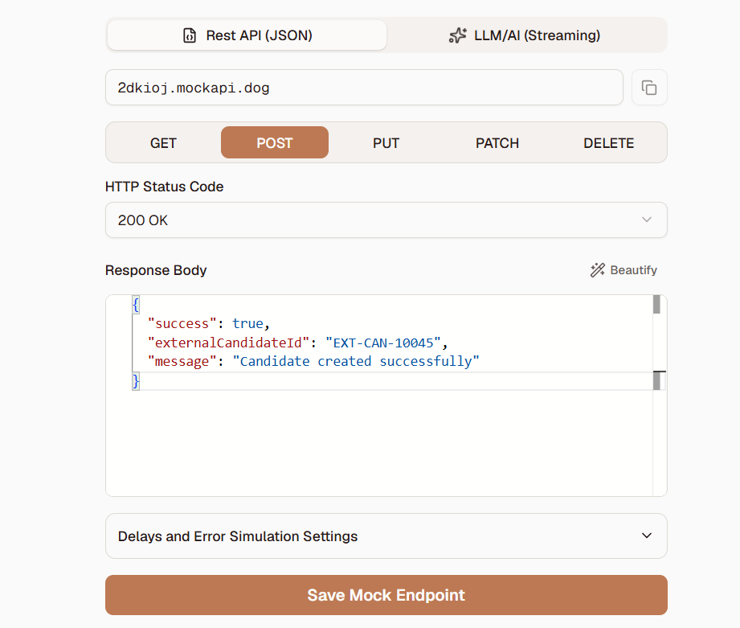

Sprint 32 -- External Recruitment Integration

1. Sprint Objective

Build an external recruitment integration in Salesforce thatautomatically sends a candidate to an external recruitment platform whenan application reaches Selected status.

Main Flow

Application Status = Selected
            ↓
Application Trigger
            ↓
Queueable Apex
            ↓
Build Candidate JSON
            ↓
Named Credential
            ↓
REST API
            ↓
Process HTTP Response
            ↓
Update Integration Status

2. Business Requirement

When a student's application is selected, Salesforce sends candidateinformation to an external recruitment platform.

The integration payload contains candidate information such as:

Application Id

Student Id

Email

Branch

CGPA

Job Id

Company

Role

Selection Date

The integration is implemented asynchronously using Queueable Apex sothat the external callout is not performed directly from the trigger.

3. Salesforce Objects

Application__c

Important fields used in the integration:

Field Label                API Name

Student                    Student__cJob                        Job__cStatus                     Status__cApplication Date           Application_Date__cSelection Date             Selection_date__cIntegration Status         Integration_Status_c__cExternal Candidate Id      External_Candidate_Id__cLast Integration Attempt   Last_Integration_Attempt__cIntegration Error          Integration_Error__c

Student__c

Fields used:

Field      API Name

Email      Email__cBranch     Branch__cCGPA       CGPA__cBacklogs   Backlogs__c

Job__c

Fields used:

Field          API Name

Job Title      NameCompany        Company__cJob Id         Job_Id__cJob Status     Job_Status__cLast Date      Last_Date__cMinimum CGPA   Minimum_CGPA__cPackage        Package__cRole           Role__c

4. Integration Status

The Application record tracks the external synchronization separatelyfrom the business status.

Integration Status   Meaning

Pending              Candidate is waiting for synchronizationSent                 External API accepted the candidateFailed               Permanent integration failureRetry Required       Temporary failure requiring retry

5. Apex Components

CandidateRequest.cls

A candidate data-transfer class was created for representing candidateinformation.

public class CandidateRequest {

    public String studentId;
    public String name;
    public String email;
    public String branch;
    public Decimal cgpa;
    public String jobId;
    public String company;
    public String role;
    public String selectionDate;

}

CandidateSyncQueueable.cls

Responsibilities:

Retrieve the selected Application.

Verify that the Application status is Selected.

Retrieve the related Student.

Retrieve the related Job.

Build the candidate JSON payload.

Send a POST request using the Named Credential.

Process the HTTP response.

Store the external candidate ID.

Store the last integration attempt.

Store integration errors.

Retry temporary server/callout failures once.

6. Trigger Flow

The integration is designed around the Application status transition:

Application
     ↓
Status = Selected
     ↓
Trigger
     ↓
System.enqueueJob()
     ↓
CandidateSyncQueueable

The external API call is handled asynchronously by Queueable Apex.

7. Named Credential

A Salesforce Named Credential is used for the external recruitment API.

Named Credential

Label: Recruitment API
Name: Recruitment_API

The Queueable calls the endpoint using:

request.setEndpoint(
    'callout:Recruitment_API/candidates'
);

Credentials and access tokens should not be hard-coded into Apex.

8. REST API Contract

Method

POST

Endpoint

/candidates

Request Content Type

application/json

Example Request

{
    "applicationId": "a01XXXXXXXXXXXX",
    "studentId": "a02XXXXXXXXXXXX",
    "email": "student@example.com",
    "branch": "CSE",
    "cgpa": 8.5,
    "jobId": "a06XXXXXXXXXXXX",
    "company": "Example Company",
    "role": "Salesforce Developer",
    "selectionDate": "2026-08-11"
}

Example Successful Response

{
    "success": true,
    "externalCandidateId": "EXT10045"
}

The returned externalCandidateId is stored automatically in:

External_Candidate_Id__c

9. HTTP Response Handling

HTTP Status   Handling

200           Success → Sent201           Success → Sent204           Success → Sent400           Failed401           Failed403           Failed500--599      Retry RequiredOther         Failed

On a successful response:

Integration Status = Sent
External Candidate Id = returned external ID
Last Integration Attempt = current Date/Time
Integration Error = blank

10. Retry Strategy

Temporary server failures are handled separately from permanentfailures.

First API attempt
       ↓
500–599 / callout exception
       ↓
Retry Required
       ↓
One retry
       ↓
Success → Sent

or

Retry fails
       ↓
Failed

Only one retry is scheduled by the current implementation.

11. Idempotency

The Salesforce Application Id is included in the request as anintegration reference.

{
    "applicationId": "a01XXXXXXXXXXXX"
}

This allows the external system to identify the Salesforce applicationassociated with the candidate and helps prevent duplicate processing.

12. Testing Through Execute Anonymous

To find a selected Application:

List<Application__c> apps = [
    SELECT Id,
           Name,
           Status__c,
           Student__c,
           Job__c,
           Integration_Status_c__c
    FROM Application__c
    WHERE Status__c = 'Selected'
    LIMIT 1
];

System.debug(
    'Selected Applications = ' + apps
);

To start the Queueable:

Id applicationId = 'YOUR_APPLICATION_ID';

Id jobId = System.enqueueJob(
    new CandidateSyncQueueable(applicationId)
);

System.debug(
    'QUEUEABLE JOB ID = ' + jobId
);

13. Verification

Step 1 -- Application

Confirm:

Status = Selected
Student = populated
Job = populated

Step 2 -- Apex Jobs

Go to:

Setup → Apex Jobs

Verify:

CandidateSyncQueueable
Status = Completed

Step 3 -- Debug Log

Check for:

Candidate Request
HTTP Status
HTTP Response
SUCCESS: Candidate synchronized.

Step 4 -- Application Result

Successful integration should show:

Integration Status = Sent
External Candidate Id = EXT10045
Last Integration Attempt = populated
Integration Error = blank

14. Successful Integration Output

Expected Output

Integration Status
Sent

External Candidate Id
EXT10045

Last Integration Attempt
[Date and Time]

Integration Error
(blank)

15. Debug Logs Output

The Debug Log should show information similar to:

Candidate Request: {...}

HTTP Status: 200

HTTP Response:
{"success":true,"externalCandidateId":"EXT10045"}

SUCCESS: Candidate synchronized.

16. API Output

Example API Response

{
    "success": true,
    "externalCandidateId": "EXT10045"
}

The response is processed by Queueable Apex and the external candidateID is saved to the Application record.

17. Complete Integration Architecture

                    SALESFORCE
                        │
                        ▼
              Application__c
                        │
                        │ Status = Selected
                        ▼
              Application Trigger
                        │
                        ▼
               Queueable Apex
                        │
                        ▼
              Candidate JSON
                        │
                        ▼
              Named Credential
                        │
                        ▼
                 REST API
              POST /candidates
                        │
                        ▼
             External Recruitment
                  Platform
                        │
                        ▼
                HTTP Response
                        │
              ┌─────────┴─────────┐
              │                   │
           Success              Failure
              │                   │
              ▼                   ▼
             Sent          Retry Required/
              │                Failed
              ▼
 External Candidate Id
              │
              ▼
       Application__c

18. Error Handling

Integration errors are stored in:

Integration_Error__c

The last attempt time is stored in:

Last_Integration_Attempt__c

This separates external integration failures from the application'sbusiness status.

For example:

Application Status = Selected
Integration Status = Retry Required

means the student is still selected, but synchronization with theexternal system needs another attempt.

19. Sprint 32 Completion Checklist

Application integration fields created

Candidate DTO created

Queueable Apex created

Named Credential configured

REST POST request implemented

JSON request generated

HTTP response processing implemented

Success status implemented

Failure handling implemented

Retry handling implemented

External Candidate Id handling implemented

Last Integration Attempt tracking implemented

Execute Anonymous testing performed

Debug log verification performed

Successful integration screenshot added

Debug log screenshot added

API screenshot added

20. Screenshots Folder

Place the screenshots in the following structure:

Sprint-32/
│
├── README.md
│
└── Screenshots/
    ├── Successful-Integration.png
    ├── Debug-Logs.png
    └── API.png

Replace the three screenshot files with your actual Salesforcescreenshots before pushing the project to GitHub.
