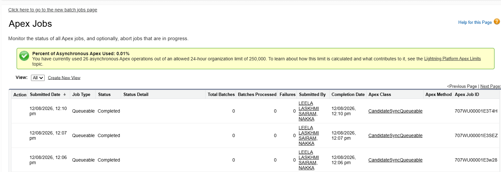
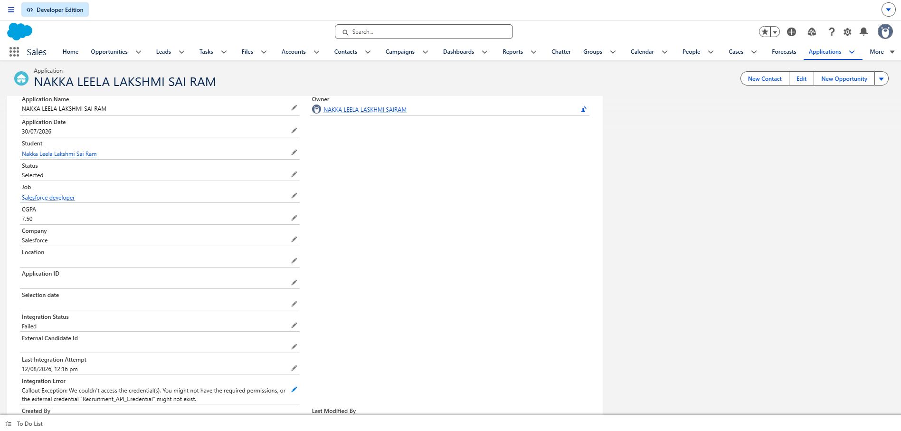
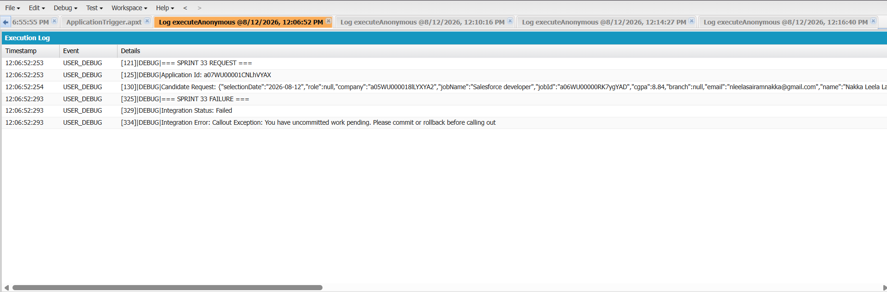

Sprint 33 – Candidate Integration with External Recruitment API

Sprint Overview

Sprint 33 implements an asynchronous candidate integration between Salesforce and an external Recruitment API.

The integration uses Apex Queueable, Database.AllowsCallouts, Named Credentials, External Credentials, Permission Sets, Execute Anonymous, Apex Jobs, and Debug Logs.

The selected candidate/application information is sent to the external API. After a successful response, Salesforce automatically updates the existing Application__c record with:

Integration Status = Sent

External Candidate ID

Last Integration Attempt

Integration Error = blank

Salesforce Object Used

Application__c

Existing Application Fields

Student__c
Job__c
Status__c
Integration_Status_c__c
External_Candidate_Id__c
Last_Integration_Attempt__c
Integration_Error__c

Student Fields

Student__r.Name
Student__r.Email__c
Student__r.Branch__c
Student__r.CGPA__c

Job Fields

Job__r.Name
Job__r.Company__c
Job__r.Role__c

Architecture

Salesforce Application
        |
        | Status = Selected
        v
Execute Anonymous
        |
        v
System.enqueueJob()
        |
        v
CandidateSyncQueueable
        |
        v
Build Candidate JSON
        |
        v
Named Credential
Recruitment_API
        |
        v
External Credential
Recruitment API Credential
        |
        v
External Recruitment API
        |
        v
HTTP Response
        |
        +-------------------------+
        |                         |
        v                         v
   200 / 201                   Error
        |                         |
        v                         v
Integration Status          Failed / Retry
      Sent
        |
        v
External Candidate ID
        |
        v
Application__c Updated

Named Credential

Label:
Recruitment API

Name:
Recruitment_API

URL:
https://candid.mockapi.dog/

Enabled for Callouts:
Yes

External Credential

Recruitment API Credential

Authentication:

No Authentication

Principal:

Recruitment_API_Credential - NoAuth

Permission Set

Recruitment API Access

The External Credential Principal must be enabled:

Recruitment_API_Credential - NoAuth

The Permission Set must also be assigned to the Salesforce user making the callout.

CandidateSyncQueueable.cls

public class CandidateSyncQueueable
    implements Queueable, Database.AllowsCallouts {

    private Id applicationId;

    public CandidateSyncQueueable(Id applicationId) {
        this.applicationId = applicationId;
    }

    public void execute(QueueableContext context) {

        Application__c app = [
            SELECT Id,
                   Status__c,
                   Student__c,
                   Student__r.Name,
                   Student__r.Email__c,
                   Student__r.Branch__c,
                   Student__r.CGPA__c,
                   Job__c,
                   Job__r.Name,
                   Job__r.Company__c,
                   Job__r.Role__c,
                   Integration_Status_c__c,
                   External_Candidate_Id__c,
                   Last_Integration_Attempt__c,
                   Integration_Error__c
            FROM Application__c
            WHERE Id = :applicationId
            LIMIT 1
        ];

        try {

            if (app.Job__c == null) {

                app.Integration_Status_c__c =
                    'Failed';

                app.Last_Integration_Attempt__c =
                    System.now();

                app.Integration_Error__c =
                    'Job is not assigned to this Application.';

                update app;

                return;
            }

            Map<String, Object> candidate =
                new Map<String, Object>();

            candidate.put(
                'salesforceApplicationId',
                String.valueOf(app.Id)
            );

            candidate.put(
                'studentId',
                String.valueOf(app.Student__c)
            );

            candidate.put(
                'name',
                app.Student__r.Name
            );

            candidate.put(
                'email',
                app.Student__r.Email__c
            );

            candidate.put(
                'branch',
                app.Student__r.Branch__c
            );

            candidate.put(
                'cgpa',
                app.Student__r.CGPA__c
            );

            candidate.put(
                'jobId',
                String.valueOf(app.Job__c)
            );

            candidate.put(
                'jobName',
                app.Job__r.Name
            );

            candidate.put(
                'company',
                app.Job__r.Company__c
            );

            candidate.put(
                'role',
                app.Job__r.Role__c
            );

            candidate.put(
                'selectionDate',
                String.valueOf(Date.today())
            );

            System.debug(
                '=== SPRINT 33 REQUEST ==='
            );

            System.debug(
                'Application Id: ' +
                app.Id
            );

            System.debug(
                'Candidate Request: ' +
                JSON.serialize(candidate)
            );

            HttpRequest request =
                new HttpRequest();

            request.setEndpoint(
                'callout:Recruitment_API/candidates'
            );

            request.setMethod('POST');

            request.setHeader(
                'Content-Type',
                'application/json'
            );

            request.setBody(
                JSON.serialize(candidate)
            );

            Http http = new Http();

            HttpResponse response =
                http.send(request);

            Integer statusCode =
                response.getStatusCode();

            String responseBody =
                response.getBody();

            System.debug(
                'HTTP Status: ' +
                statusCode
            );

            System.debug(
                'API Response: ' +
                responseBody
            );

            if (
                statusCode == 200 ||
                statusCode == 201
            ) {

                Map<String, Object> result =
                    (Map<String, Object>)
                    JSON.deserializeUntyped(
                        responseBody
                    );

                if (
                    result.containsKey(
                        'externalCandidateId'
                    )
                ) {

                    app.External_Candidate_Id__c =
                        String.valueOf(
                            result.get(
                                'externalCandidateId'
                            )
                        );
                }

                app.Integration_Status_c__c =
                    'Sent';

                app.Last_Integration_Attempt__c =
                    System.now();

                app.Integration_Error__c =
                    null;

                update app;

                System.debug(
                    '=== SPRINT 33 SUCCESS ==='
                );

                System.debug(
                    'Integration Status: ' +
                    app.Integration_Status_c__c
                );

                System.debug(
                    'External Candidate Id: ' +
                    app.External_Candidate_Id__c
                );

            } else if (statusCode == 400) {

                saveFailure(
                    app,
                    'Bad Request: ' +
                    responseBody,
                    'Failed'
                );

            } else if (statusCode == 401) {

                saveFailure(
                    app,
                    'Authentication Failed: ' +
                    responseBody,
                    'Failed'
                );

            } else if (statusCode == 403) {

                saveFailure(
                    app,
                    'Forbidden: ' +
                    responseBody,
                    'Failed'
                );

            } else if (statusCode >= 500) {

                saveFailure(
                    app,
                    'Server Error: ' +
                    responseBody,
                    'Retry Required'
                );

            } else {

                saveFailure(
                    app,
                    'Unexpected Response ' +
                    statusCode +
                    ': ' +
                    responseBody,
                    'Failed'
                );
            }

        } catch (Exception e) {

            app.Integration_Status_c__c =
                'Failed';

            app.Last_Integration_Attempt__c =
                System.now();

            app.Integration_Error__c =
                'Callout Exception: ' +
                e.getMessage();

            update app;

            System.debug(
                '=== SPRINT 33 EXCEPTION ==='
            );

            System.debug(
                'Error: ' +
                e.getMessage()
            );
        }
    }

    private void saveFailure(
        Application__c app,
        String errorMessage,
        String status
    ) {

        app.Integration_Status_c__c =
            status;

        app.Last_Integration_Attempt__c =
            System.now();

        app.Integration_Error__c =
            errorMessage;

        update app;

        System.debug(
            '=== SPRINT 33 FAILURE ==='
        );

        System.debug(
            'Integration Status: ' +
            status
        );

        System.debug(
            'Integration Error: ' +
            errorMessage
        );
    }
}

Execute Anonymous

List<Application__c> apps = [
    SELECT Id,
           Status__c,
           Job__c
    FROM Application__c
    WHERE Status__c = 'Selected'
    AND Job__c != null
    ORDER BY LastModifiedDate DESC
    LIMIT 1
];

if (apps.isEmpty()) {

    System.debug(
        'NO SELECTED APPLICATION WITH JOB FOUND'
    );

} else {

    Application__c app = apps[0];

    System.debug(
        '=== SPRINT 33 START ==='
    );

    System.debug(
        'Application Id: ' +
        app.Id
    );

    System.debug(
        'Job Id: ' +
        app.Job__c
    );

    Id queueableJobId =
        System.enqueueJob(
            new CandidateSyncQueueable(
                app.Id
            )
        );

    System.debug(
        'Queueable Job Id: ' +
        queueableJobId
    );

    System.debug(
        '=== SPRINT 33 QUEUED ==='
    );
}

Apex Jobs Output

Go to:

Setup → Apex Jobs

Expected:

Job Type: Queueable
Apex Class: CandidateSyncQueueable
Status: Completed
Apex Job ID: 707XXXXXXXXXXXX

Debug Logs

Successful log:

=== SPRINT 33 REQUEST ===

Application Id: a07XXXXXXXXXXXX

Candidate Request:
{...}

HTTP Status: 200

API Response:
{...}

=== SPRINT 33 SUCCESS ===

Integration Status: Sent

External Candidate Id:
EXT-CAND-1001

Successful Salesforce Output

The Application record should automatically show:

Integration Status
Sent

External Candidate Id
EXT-CAND-1001

Last Integration Attempt
<Current Date/Time>

Integration Error
(blank)

Failure Output

For a normal client-side failure:

Integration Status
Failed

For server errors:

Integration Status
Retry Required

The error message is stored in:

Integration_Error__c

Important Callout Fix

Do not perform DML before the HTTP callout.

Incorrect:

update app;

HttpResponse response =
    http.send(request);

Correct:

HttpResponse response =
    http.send(request);

app.Integration_Status_c__c =
    'Sent';

app.External_Candidate_Id__c =
    externalId;

update app;

This prevents:

You have uncommitted work pending.
Please commit or rollback before calling out.

Screenshots

Create a Screenshots folder beside this README file.

Sprint-33/
│
├── README.md
│
└── Screenshots/
    ├── Task-1-Queueable.png
    ├── Task-2-Named-Credential.png
    ├── Task-3-External-Credential.png
    ├── Task-4-Permission-Set.png
    ├── Task-5-Execute-Anonymous.png
    ├── Task-6-Apex-Jobs.png
    ├── Task-7-Debug-Logs.png
    ├── Task-8-Success-Output.png
    └── Task-9-External-Candidate-Id.png

Screenshot References

Sprint 33 Completion Checklist

Existing Application__c object used

Existing Student relationship used

Existing Job relationship used

Existing Integration Status field used

Existing External Candidate ID field used

Queueable Apex created

Database.AllowsCallouts implemented

Named Credential configured

External Credential configured

Permission Set configured

Candidate JSON generated

HTTP POST callout implemented

HTTP response handled

External Candidate ID stored

Integration Status updated automatically

Error handling implemented

Apex Jobs verified

Debug Logs verified

DML-before-callout issue resolved

Final Result

Application
    ↓
Selected Candidate
    ↓
Queueable Apex
    ↓
Candidate JSON
    ↓
Named Credential
    ↓
External Recruitment API
    ↓
HTTP 200 / 201
    ↓
External Candidate ID
    ↓
Application Updated
    ↓
Integration Status = Sent

Sprint 33 Status

COMPLETED
