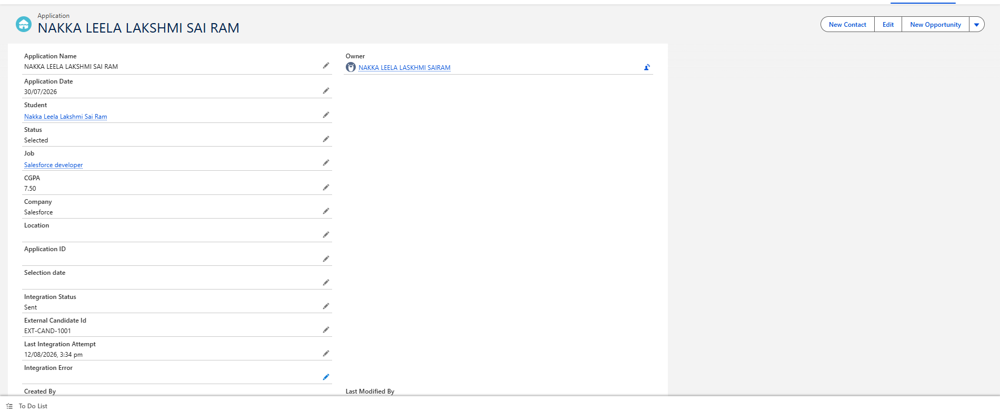
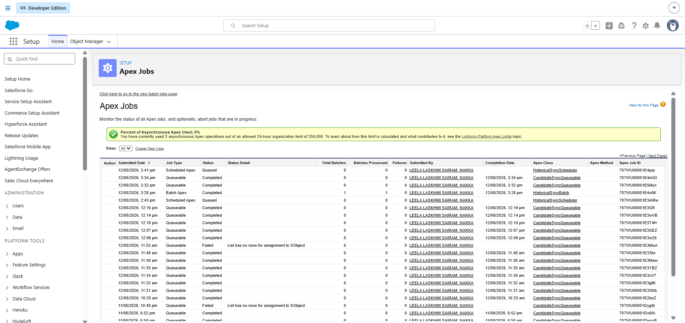
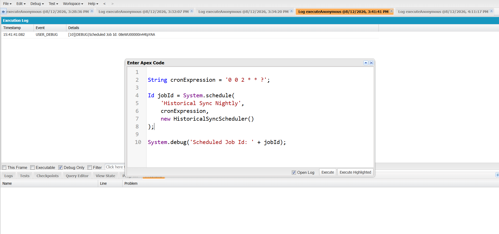

Sprint 34 – Advanced Salesforce Integration Architecture

Sprint Overview

Sprint 34 implements three Salesforce integration patterns:

Immediate Certification Verification

Candidate Synchronisation

Historical Synchronisation

The integration uses LWC, Apex, Queueable Apex, Scheduled Apex, Batch Apex,HTTP Callouts, Named Credentials, External Credentials, Permission Sets,Execute Anonymous, Apex Jobs, and Debug Logs.

The sprint demonstrates when to use synchronous and asynchronous integrationpatterns based on the business requirement.

Salesforce Objects Used

Application Object

Application__c

Existing Application Fields

Student__cJob__cStatus__cIntegration_Status_c__cExternal_Candidate_Id__cLast_Integration_Attempt__cIntegration_Error__c

Student Fields

Student__r.NameStudent__r.Email__cStudent__r.Branch__cStudent__r.CGPA__c

Job Fields

Job__r.NameJob__r.Company__cJob__r.Role__c

No new Salesforce object is required for Candidate Synchronisation.

Part A – Immediate Certification Verification

Business Requirement

When a student enters a certification number, Salesforce sends thecertification number to an external certification service.

The response is immediately displayed in the LWC.

Architecture

Certification Verification LWC
        |
        v
CertificationVerificationController
        |
        v
Named Credential
Certification_API
        |
        v
External Certification API
        |
        v
HTTP Response
        |
        v
LWC
        |
        v
Verification Result

LWC Component

Component Name:

certificationVerification

Files:

certificationVerification/
│
├── certificationVerification.html
├── certificationVerification.js
└── certificationVerification.js-meta.xml

Apex Controller

CertificationVerificationController.cls

The Apex controller:

Receives the certification number.

Creates an HTTP request.

Sends the request to the external API.

Processes the HTTP response.

Returns the response to the LWC.

Handles HTTP errors.

Named Credential

Label:

Certification API

Name:

Certification_API

Authentication:

No Authentication

Enabled for Callouts:

Yes

Apex endpoint:

request.setEndpoint(
    'callout:Certification_API/verify'
);

Certification Test

Certification Number:

CERT001

Expected successful output:

=== CERTIFICATION VERIFICATION ===

Certification Number: CERT001

Certification Verified

Certification: Salesforce Administrator

Student: Akshay

Verification Successful

Part B – Candidate Synchronisation

Business Requirement

When an Application becomes Selected, Salesforce sends the candidateinformation to the external Recruitment API.

The integration is performed asynchronously using Queueable Apex.

Architecture

Salesforce Application__c
        |
        | Status = Selected
        v
ApplicationIntegrationTrigger
        |
        v
CandidateSyncQueueable
        |
        v
Build Candidate JSON
        |
        v
Named Credential
Recruitment_API
        |
        v
External Recruitment API
        |
        v
HTTP Response
        |
        +--------------------------+
        |                          |
        v                          v
    200 / 201                   Error
        |                          |
        v                          v
Integration Status          Failed / Retry Required
Sent
        |
        v
External Candidate ID
        |
        v
Application__c Updated

ApplicationIntegrationTrigger

File:

ApplicationIntegrationTrigger.trigger

The trigger detects when the Application status changes to:

Selected

Then it starts:

CandidateSyncQueueable

The Trigger does not perform the HTTP callout directly.

CandidateSyncQueueable

File:

CandidateSyncQueueable.cls

The Queueable implements:

Queueable
Database.AllowsCallouts

Candidate Data

The Queueable reads:

Application Id
Student Id
Student Name
Student Email
Student Branch
Student CGPA
Job Id
Job Name
Company
Role
Selection Date

Candidate JSON

Example:

{
    "salesforceApplicationId": "a07XXXXXXXXXXXX",
    "studentId": "a01XXXXXXXXXXXX",
    "name": "Akshay",
    "email": "student@example.com",
    "branch": "CSE",
    "cgpa": 8.8,
    "jobId": "a02XXXXXXXXXXXX",
    "jobName": "Software Developer",
    "company": "Example Company",
    "role": "Software Developer",
    "selectionDate": "2026-08-12"
}

Recruitment API Named Credential

Label:

Recruitment API

Name:

Recruitment_API

URL:

https://candid.mockapi.dog/

Enabled for Callouts:

Yes

Apex endpoint:

request.setEndpoint(
    'callout:Recruitment_API/candidates'
);

External Credential

External Credential:

Recruitment API Credential

Authentication:

No Authentication

Principal:

Recruitment_API_Credential - NoAuth

Permission Set

Permission Set:

Recruitment API Access

The External Credential Principal must be enabled:

Recruitment_API_Credential - NoAuth

The Permission Set must be assigned to the Salesforce user making thecallout.

Integration Status

Successful Flow

Selected
    |
    v
Queueable
    |
    v
External Recruitment API
    |
    v
HTTP 200 / 201
    |
    v
Integration Status
Sent
    |
    v
External Candidate ID

Failure Flow

For a normal client-side failure:

HTTP 400 / 401 / 403
        |
        v
Integration Status
Failed

For server-side failures:

HTTP 500+
        |
        v
Integration Status
Retry Required

Successful API Response

Example:

{
    "externalCandidateId": "EXT-CAND-1001"
}

Salesforce automatically updates the existing Application__c record:

Integration Status
Sent

External Candidate Id
EXT-CAND-1001

Last Integration Attempt
<Current Date/Time>

Integration Error
(blank)

Execute Anonymous

Open:

Developer Console
        ↓
Debug
        ↓
Open Execute Anonymous Window

Run:

List<Application__c> apps = [
    SELECT Id,
           Status__c,
           Job__c
    FROM Application__c
    WHERE Status__c = 'Selected'
    AND Job__c != null
    ORDER BY LastModifiedDate DESC
    LIMIT 1
];

if (apps.isEmpty()) {

    System.debug(
        'NO SELECTED APPLICATION WITH JOB FOUND'
    );

} else {

    Application__c app = apps[0];

    System.debug(
        '=== SPRINT 34 START ==='
    );

    System.debug(
        'Application Id: ' +
        app.Id
    );

    System.debug(
        'Job Id: ' +
        app.Job__c
    );

    Id queueableJobId =
        System.enqueueJob(
            new CandidateSyncQueueable(
                app.Id
            )
        );

    System.debug(
        'Queueable Job Id: ' +
        queueableJobId
    );

    System.debug(
        '=== SPRINT 34 QUEUED ==='
    );
}

Apex Jobs Output

Go to:

Setup → Apex Jobs

Expected:

Job Type:
Queueable

Apex Class:
CandidateSyncQueueable

Status:
Completed

Apex Job ID:
707XXXXXXXXXXXX

Debug Logs

Successful log:

=== SPRINT 34 REQUEST ===

Application Id: a07XXXXXXXXXXXX

Candidate Request:
{...}

HTTP Status: 200

API Response:
{
    "externalCandidateId": "EXT-CAND-1001"
}

=== SPRINT 34 SUCCESS ===

Integration Status: Sent

External Candidate Id:
EXT-CAND-1001

Successful Salesforce Output

The Application record should automatically show:

Integration Status
Sent

External Candidate Id
EXT-CAND-1001

Last Integration Attempt
<Current Date/Time>

Integration Error
(blank)

Failure Output

For a normal client-side failure:

Integration Status
Failed

For server errors:

Integration Status
Retry Required

The error message is stored in:

Integration_Error__c

Important Callout Fix

Do not perform DML before the HTTP callout in the same transaction.

Incorrect:

update app;

HttpResponse response =
    http.send(request);

Correct:

HttpResponse response =
    http.send(request);

app.Integration_Status_c__c =
    'Sent';

app.External_Candidate_Id__c =
    externalId;

update app;

This prevents:

You have uncommitted work pending.
Please commit or rollback before calling out.

Part C – Historical Synchronisation

Business Requirement

Historical data must be processed on a scheduled basis using Batch Apex.

The integration uses Scheduled Apex to start the Batch Apex process.

Architecture

Scheduled Apex
        |
        v
HistoricalSyncScheduler
        |
        v
HistoricalSyncBatch
        |
        v
External API
        |
        v
HTTP Response
        |
        +---------------------+
        |                     |
        v                     v
     Success               Failure
        |                     |
        v                     v
   Process Data       Error / Retry

HistoricalSyncScheduler

File:

HistoricalSyncScheduler.cls

Code:

global class HistoricalSyncScheduler
    implements Schedulable {

    global void execute(
        SchedulableContext sc
    ) {

        Database.executeBatch(
            new HistoricalSyncBatch(),
            50
        );
    }
}

HistoricalSyncBatch

File:

HistoricalSyncBatch.cls

The Batch processes records in manageable scopes.

Test scope:

50 records

Execute Historical Batch

Id batchJobId =
    Database.executeBatch(
        new HistoricalSyncBatch(),
        50
    );

System.debug(
    'Historical Batch Job Id: ' +
    batchJobId
);

Schedule Historical Integration

String cronExpression =
    '0 0 2 * * ?';

Id jobId =
    System.schedule(
        'Historical Sync Nightly',
        cronExpression,
        new HistoricalSyncScheduler()
    );

System.debug(
    'Scheduled Job Id: ' +
    jobId
);

If the job named:

Historical Sync Nightly

is already scheduled, do not schedule it again with the same name.

Historical API Note

The Sprint 34 material defines the Scheduled Apex and Batch Apexarchitecture, but it does not define a concrete historical API endpointor response JSON contract.

Therefore, the actual historical endpoint must be replaced with theendpoint supplied by the external API used by the project.

Error Handling

HTTP responses are handled as follows:

200 / 201
    ↓
Success

400
    ↓
Failed

401
    ↓
Authentication Failed

403
    ↓
Forbidden

500+
    ↓
Retry Required

Other
    ↓
Unexpected Response

Screenshots

Create a Screenshots folder beside this README file.

Sprint-34/
│
├── README.md
│
└── Screenshots/
    ├── ApplicationSuccessful.png
    ├── Apexjobs.png
    └── debuglogsoutput.png

Screenshot References

Sprint 34 Completion Checklist

Existing Application__c object used

Existing Student relationship used

Existing Job relationship used

Existing Integration Status field used

Existing External Candidate ID field used

Certification Verification LWC created

Certification Apex Controller created

CandidateSyncQueueable created

Database.AllowsCallouts implemented

ApplicationIntegrationTrigger created

Named Credential configured

External Credential configured

Permission Set configured

Candidate JSON generated

HTTP POST callout implemented

HTTP response handled

External Candidate ID stored

Integration Status updated automatically

Integration Error handled

Apex Jobs verified

Debug Logs verified

Scheduled Apex created

Batch Apex created

Historical integration architecture implemented

DML-before-callout issue resolved

Final Result

Part A – Certification Verification

LWC
    ↓
CertificationVerificationController
    ↓
Certification_API
    ↓
External Certification API
    ↓
Verification Response
    ↓
LWC

Part B – Candidate Integration

Application
    ↓
Status = Selected
    ↓
ApplicationIntegrationTrigger
    ↓
CandidateSyncQueueable
    ↓
Candidate JSON
    ↓
Recruitment_API
    ↓
External Recruitment API
    ↓
HTTP 200 / 201
    ↓
External Candidate ID
    ↓
Application Updated
    ↓
Integration Status = Sent

Part C – Historical Integration

Scheduled Apex
    ↓
HistoricalSyncScheduler
    ↓
HistoricalSyncBatch
    ↓
External API
    ↓
Response
    ↓
Success / Error
    ↓
Retry if Required

Sprint 34 Status

COMPLETED
