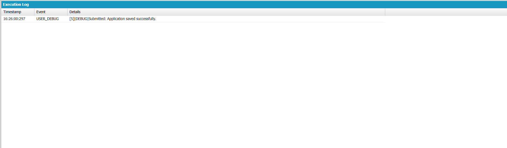

# Engineering Sprint 10 – Creating the Application

## 📌 Objective

Create and save a new application record after all business validations have been completed successfully.

---

## 📖 Business Requirement

Once the student satisfies all eligibility criteria and no duplicate application exists, the application should be stored in Salesforce using DML.

The Placement Office should be able to view the newly created application record.

---

## 📂 Source Code Files

```
ApplicationService.cls
Application__c
Execute Anonymous
```

---

## ⚙️ Apex Class

```apex
public with sharing class ApplicationService {

    public static String submitApplication(Id studentId, Id jobId) {

        Student__c student = [
            SELECT CGPA__c,
                   Backlogs__c
            FROM Student__c
            WHERE Id = :studentId
            LIMIT 1
        ];

        Job__c job = [
            SELECT Minimum_CGPA__c
            FROM Job__c
            WHERE Id = :jobId
            LIMIT 1
        ];

        if(student.CGPA__c < job.Minimum_CGPA__c){
            return 'Rejected: Minimum CGPA requirement not met.';
        }

        if(student.Backlogs__c > 0){
            return 'Rejected: Student has active backlogs.';
        }

        Application__c app = new Application__c();

        app.Student__c = studentId;
        app.Application_Date__c = Date.today();
        app.Status__c = 'Applied';

        try{

            insert app;

            return 'Submitted: Application saved successfully.';

        }catch(DmlException e){

            return 'Failed: ' + e.getDmlMessage(0);

        }

    }

}
```

---

## ▶️ Execute Anonymous

```apex
Id studentId = 'a04WU00000DWEbRYAX';
Id jobId = 'a06WU00000R7V5xYAF';

String result = ApplicationService.submitApplication(studentId, jobId);

System.debug(result);
```

---

# 🐞 Debug Output

The following execution log confirms that the application record was successfully created and saved into Salesforce.

> **Execution Log**



**Observed Output**

```
USER_DEBUG

Submitted: Application saved successfully.
```

The debug output verifies that:

- Student information was retrieved successfully.
- Job eligibility criteria were validated.
- Business validations completed successfully.
- A new **Application__c** record was created.
- The record was saved using DML.
- A confirmation message was returned to the user.

---

## ✅ Expected Behaviour

- Student passes eligibility validation.
- Application record created successfully.
- Record saved into Salesforce.
- User receives a confirmation message.

---

## 🚧 Challenges

- Understanding the DML Insert operation.
- Handling exceptions using try-catch blocks.
- Working with restricted picklist values.
- Ensuring validations occur before DML.

---

## 💡 Reflection

This sprint demonstrated how enterprise applications persist business data only after every validation has been completed successfully. Delaying DML until the end of the transaction helps maintain data integrity and prevents invalid records from entering the system.

---

## 📚 Engineering Principle

> Never perform DML until every business rule has been verified.

---

## 🛠 Technologies Used

- Salesforce Apex
- SOQL
- DML
- Developer Console
- Execute Anonymous
- Custom Objects

---

## 📖 Key Learning Outcomes

- Retrieved business information using SOQL.
- Applied eligibility validation before database operations.
- Created new records using DML Insert.
- Handled exceptions with try-catch blocks.
- Verified successful execution using Salesforce Debug Logs.

---

## 📁 Source Code Files

```
ApplicationService.cls
Application__c
Student__c
Job__c
Execute Anonymous
README.md
```

---

## 🎯 Engineering Lesson Learned

Business transactions should modify Salesforce data only after all required validations have passed. Performing DML as the final step ensures reliable, maintainable, and accurate enterprise applications.
