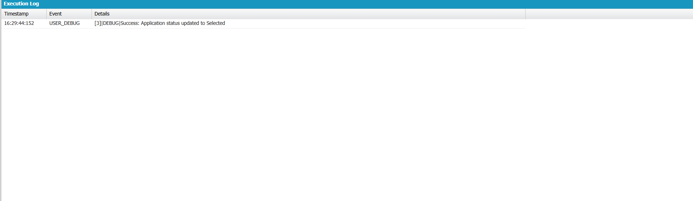

# Engineering Sprint 11 – Updating Application Status

## 📌 Objective

Update the application status after the recruiter completes the candidate evaluation process.

---

## 📖 Business Requirement

Once the recruiter reviews a student's application, the application status should be updated to reflect the recruitment outcome.

Possible status values include:

- Applied
- Shortlisted
- Interview Scheduled
- Selected
- Rejected

The existing application record should be updated instead of creating a new record.

---

## 📂 Source Code Files

```
ApplicationService.cls
Application__c
Execute Anonymous
```

---

## ⚙️ Apex Class

```apex
public with sharing class ApplicationService {

    public static String updateApplicationStatus(Id applicationId, String status){

        try{

            Application__c app = [
                SELECT Id, Status__c
                FROM Application__c
                WHERE Id = :applicationId
                LIMIT 1
            ];

            app.Status__c = status;

            update app;

            return 'Success: Application status updated to ' + status;

        }catch(DmlException e){

            return 'Failed: ' + e.getDmlMessage(0);

        }

    }

}
```

---

## ▶️ Execute Anonymous

```apex
Id applicationId = 'YOUR_APPLICATION_ID';

System.debug(
    ApplicationService.updateApplicationStatus(
        applicationId,
        'Selected'
    )
);
```

---

# 🐞 Debug Output

The following execution log confirms that the application status was successfully updated after the recruiter completed the review.

> **Execution Log**



**Observed Output**

```
USER_DEBUG

Success: Application status updated to Selected
```

The debug output verifies that:

- Existing Application record retrieved successfully.
- Status field updated successfully.
- DML Update executed successfully.
- Database changes committed successfully.
- Confirmation message returned to the user.

---

## ✅ Expected Behaviour

- Existing Application record retrieved.
- Application status updated successfully.
- Record saved using DML Update.
- User receives a meaningful confirmation message.

---

## 🚧 Challenges

- Understanding the difference between Insert and Update DML operations.
- Retrieving the correct Application record before updating.
- Using valid restricted picklist values.
- Handling DML exceptions gracefully.

---

## 💡 Reflection

This sprint demonstrated the importance of updating existing business records instead of creating duplicate records. Proper use of DML Update ensures accurate tracking of the recruitment process while maintaining data consistency.

---

## 📚 Engineering Principle

> Update existing business data only after identifying the correct record.

---

## 🛠 Technologies Used

- Salesforce Apex
- SOQL
- DML Update
- Developer Console
- Execute Anonymous
- Custom Objects

---

## 📖 Key Learning Outcomes

- Retrieved existing Salesforce records using SOQL.
- Updated records using DML Update.
- Applied meaningful application status values.
- Handled database update exceptions.
- Verified successful execution using Salesforce Debug Logs.

---

## 📁 Source Code Files

```
ApplicationService.cls
Application__c
Execute Anonymous
README.md
```

---

## 🎯 Engineering Lesson Learned

Enterprise applications should update existing records rather than creating unnecessary duplicates. Performing controlled updates with clear status values improves data accuracy, maintainability, and the overall recruitment workflow.
