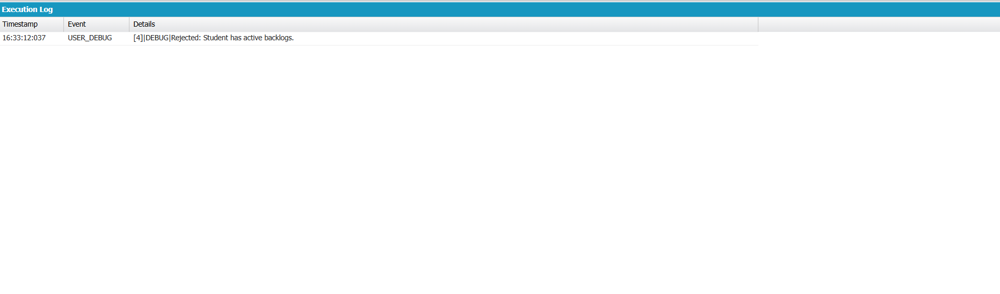

# Engineering Sprint 12 – Completing the Business Transaction

## 📌 Objective

Complete the end-to-end business transaction by combining SOQL, DML, and Apex into a single workflow for processing student job applications.

---

## 📖 Business Requirement

The application should successfully perform the following sequence:

```text
Receive Request
        ↓
Retrieve Student
        ↓
Retrieve Job
        ↓
Check Duplicate
        ↓
Validate Eligibility
        ↓
Create Application
        ↓
Save Record
        ↓
Display Confirmation
```

If every step executes successfully, the software completes a full business transaction.

---

## 📂 Source Code Files

```
ApplicationService.cls
Student__c
Job__c
Application__c
Execute Anonymous
```

---

## ⚙️ Apex Class

```apex
public with sharing class ApplicationService {

    public static String submitApplication(Id studentId, Id jobId){

        // Retrieve Student
        Student__c student = [
            SELECT CGPA__c,
                   Backlogs__c
            FROM Student__c
            WHERE Id = :studentId
            LIMIT 1
        ];

        // Retrieve Job
        Job__c job = [
            SELECT Minimum_CGPA__c
            FROM Job__c
            WHERE Id = :jobId
            LIMIT 1
        ];

        // Duplicate Validation
        List<Application__c> applications = [
            SELECT Id
            FROM Application__c
            WHERE Student__c = :studentId
            LIMIT 1
        ];

        if(!applications.isEmpty()){
            return 'Rejected: Duplicate application found.';
        }

        // Eligibility Validation
        if(student.CGPA__c < job.Minimum_CGPA__c){
            return 'Rejected: Minimum CGPA requirement not met.';
        }

        if(student.Backlogs__c > 0){
            return 'Rejected: Student has active backlogs.';
        }

        // Create Application
        Application__c app = new Application__c();

        app.Student__c = studentId;
        app.Application_Date__c = Date.today();
        app.Status__c = 'Applied';

        try{

            insert app;

            return 'Submitted: Application processed successfully.';

        }catch(DmlException e){

            return 'Failed: ' + e.getDmlMessage(0);

        }

    }

}
```

---

## ▶️ Execute Anonymous

```apex
Id studentId = 'a04WU00000DWEbRYAX';
Id jobId = 'a06WU00000R7V5xYAF';

String result = ApplicationService.submitApplication(studentId, jobId);

System.debug(result);
```

---

# 🐞 Debug Output

The following execution logs verify the final business transaction workflow.

### Debug Output 1 – Application Processing



**Observed Output**

```
USER_DEBUG

Rejected: Student has active backlogs.
```

This confirms that:

- Student information was retrieved successfully.
- Job eligibility was retrieved successfully.
- Business validation detected active backlogs.
- Application processing stopped before performing DML.
- Meaningful feedback was returned to the user.

---

### Debug Output 2 – SOQL Query Verification

.png)

The Developer Console was used to verify object records using SOQL queries before processing the business transaction.

Example Queries

```sql
SELECT Id, Name
FROM Student__c
```

```sql
SELECT Id, Name
FROM Job__c
```

This verifies that:

- Student records exist.
- Job records exist.
- Required Salesforce data is available before business processing.

---

## ✅ Complete Business Workflow

```
Receive Application Request
          │
          ▼
Retrieve Student Record
          │
          ▼
Retrieve Job Record
          │
          ▼
Check Duplicate Application
          │
          ▼
Validate Student Eligibility
          │
          ▼
Create Application Record
          │
          ▼
Save Record using DML
          │
          ▼
Return Confirmation Message
```

---

## 🚧 Challenges

- Combining multiple business operations into one workflow.
- Maintaining proper execution order.
- Preventing DML before validation.
- Returning meaningful messages.
- Understanding enterprise transaction flow.

---

## 💡 Reflection

This sprint demonstrated how enterprise software combines multiple business operations into a single transaction. Retrieving accurate information, validating business rules, and updating Salesforce only after successful validation improves reliability, maintainability, and overall software quality.

---

## 📚 Engineering Principle

> Business validation should always precede database changes.

---

## 🛠 Technologies Used

- Salesforce Apex
- SOQL
- DML
- Developer Console
- Execute Anonymous
- Custom Objects

---

## 📖 Key Learning Outcomes

- Built a complete enterprise business transaction.
- Combined SOQL, DML, and Apex.
- Applied business validations before DML.
- Prevented invalid database operations.
- Returned meaningful feedback messages.
- Verified execution using Debug Logs and SOQL queries.

---

## 📁 Source Code Files

```
ApplicationService.cls
Student__c
Job__c
Application__c
Execute Anonymous
README.md
```

---

## 🎯 Engineering Lesson Learned

A successful enterprise application is not just a collection of SOQL queries and DML statements. It is a carefully designed business transaction where information is retrieved, business rules are validated, data is modified responsibly, and meaningful feedback is provided to the user.
