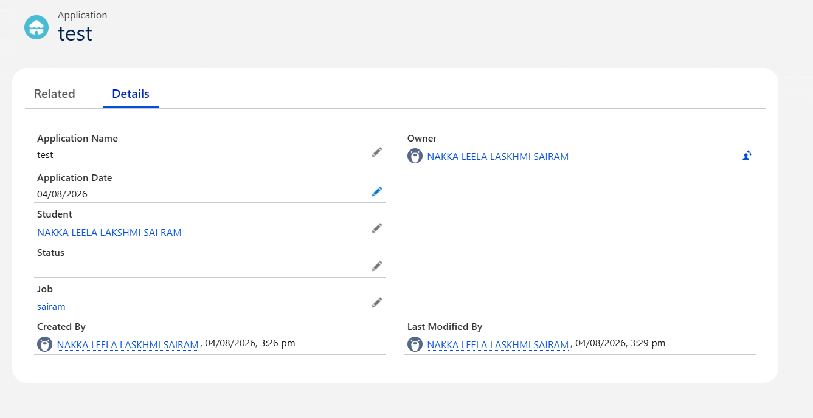

# Sprint 13 – Responding to a New Application

## 📌 Sprint Objective

The objective of Sprint 13 is to automatically validate every new **Application** before it is saved in Salesforce.

Instead of asking users to manually validate the application, Salesforce performs the validation automatically using an **Apex Trigger** and delegates the business logic to **ApplicationService**.

---

# 📖 User Story

**US-13 – Automatically Validate New Applications Before Saving**

**As a** Placement Officer,

**I want** every Application record to be validated automatically,

**So that** only valid applications are saved into the system.

---

# 🎯 Learning Outcomes

After completing this sprint, I learned to:

- Understand the purpose of Apex Triggers.
- Use **Before Insert Trigger**.
- Understand Event-Driven Programming.
- Delegate business logic to a Service Class.
- Validate records using `addError()`.
- Follow Salesforce Best Practices.
- Build clean and maintainable Trigger architecture.

---

# 🏢 Business Requirement

Whenever a student submits a new application,

Salesforce should automatically verify all business rules before saving the record.

Validation should happen automatically without requiring the user to click any additional button.

The Trigger should only recognize the event and delegate the validation to **ApplicationService**.

---

# 🏗️ Folder Structure

```text
force-app
└── main
    └── default
        ├── triggers
        │      ApplicationTrigger.trigger
        │
        └── classes
               ApplicationService.cls
               ApplicationServiceTest.cls
```

---

# ⚙️ Apex Trigger

## ApplicationTrigger.trigger

```apex
trigger ApplicationTrigger on Application__c (before insert) {

    if (Trigger.isBefore && Trigger.isInsert) {

        ApplicationService.validateApplications(Trigger.new);

    }

}
```

---

# ⚙️ Service Class

## ApplicationService.cls

```apex
public with sharing class ApplicationService {

    public static void validateApplications(
        List<Application__c> applications
    ) {

        for(Application__c app : applications){

            if(app.Student__c == null){

                app.addError('Student is required.');

            }

            if(app.Job__c == null){

                app.addError('Job is required.');

            }

            if(app.Application_Date__c == null){

                app.addError('Application Date is required.');

            }

        }

    }

}
```

---

# 🧪 Test Scenario

## Scenario 1

Application Date is empty.

### Expected Result

The Trigger automatically calls ApplicationService.

ApplicationService validates the record.

Salesforce displays the validation error.

```
Application Date is required.
```

The record is **not saved**.

---

## Scenario 2

Student, Job and Application Date are entered correctly.

### Expected Result

ApplicationService completes validation successfully.

The Application record is saved into Salesforce.

---

# 🔄 Execution Flow

```text
User Creates Application

        │

        ▼

ApplicationTrigger

        │

        ▼

ApplicationService

        │

        ▼

Business Validation

        │

        ▼

Record Saved / Validation Error
```

---

# 💻 Code Explanation

## Trigger

```apex
before insert
```

Executes before the record is stored in Salesforce.

---

```apex
Trigger.new
```

Contains all Application records currently being inserted.

---

```apex
ApplicationService.validateApplications()
```

Delegates the validation logic to the Service Class.

The Trigger contains no business logic.

---

## ApplicationService

The Service Class performs all business validations.

Example validations:

- Student must exist.
- Job must exist.
- Application Date must exist.

If any validation fails,

```apex
app.addError();
```

prevents Salesforce from saving the record.

---

# 🧱 Engineering Principle

> A Trigger should coordinate—not calculate.

The Trigger only detects the event.

ApplicationService performs all business validations.

This keeps the application modular and maintainable.

---

# 📸 Output – Validation Error

When the **Application Date** field is left blank and the user clicks **Save**, the Trigger invokes `ApplicationService`, which validates the record and displays the following error.

**Validation Error Screenshot**


**Observed Result**

- Application Date is mandatory.
- Salesforce prevents the record from being saved.
- The user receives the message:
  - **Application Date is required.**

---

# 📸 Output – Record Saved Successfully

After entering a valid **Application Date**, the Trigger validation succeeds and Salesforce saves the record successfully.

**Successful Record Creation Screenshot**



**Observed Result**

- Application record created successfully.
- Student lookup populated.
- Job lookup populated.
- Application Date stored correctly.
- Validation completed automatically.

---

# 🚀 Challenges Faced

- Understanding Trigger Events.
- Understanding Before Insert Trigger.
- Delegating business logic to Service Classes.
- Implementing validation using `addError()`.
- Testing Trigger execution.

---

# 📚 Key Learnings

- Apex Trigger
- Before Insert Trigger
- Trigger.new
- Service Class
- Business Validation
- Event Driven Programming
- addError()
- Clean Architecture

---

# 📝 Outcome

Successfully implemented **Sprint 13** by developing an Apex Trigger that automatically validates every new Application record before it is saved.

The Trigger detects the business event and delegates validation to `ApplicationService`, ensuring that business rules are enforced consistently while keeping the Trigger clean, reusable, and easy to maintain.
