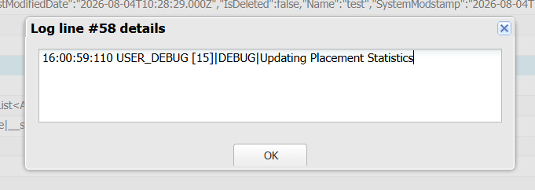
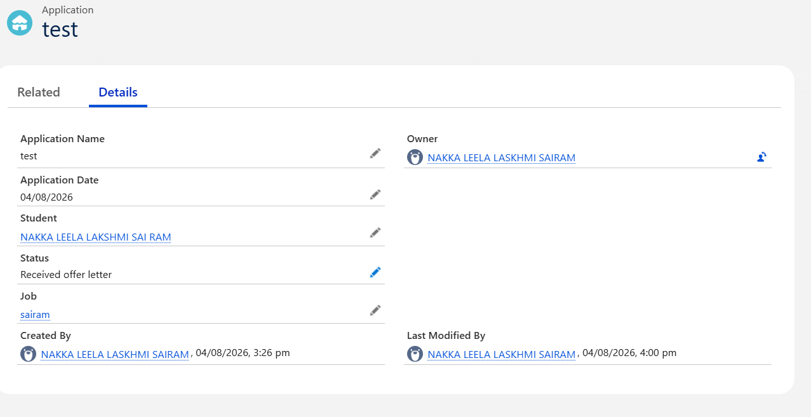

# Sprint 14 – Updating Placement Statistics

## 📌 Sprint Objective

The objective of Sprint 14 is to automatically update placement statistics whenever an application's status changes.

Instead of writing statistics logic inside the Apex Trigger, Salesforce delegates the responsibility to a dedicated **StatisticsService** class.

This architecture keeps the Trigger clean, reusable, and easy to maintain.

---

# 📖 User Story

**US-14 – Automatically Update Placement Statistics**

**As a** Placement Officer,

**I want** placement statistics to be updated automatically,

**So that** dashboards and reports always display the latest placement information.

---

# 🎯 Learning Outcomes

After completing this sprint, I learned to

- Understand After Update Trigger.
- Use Trigger.new and Trigger.oldMap.
- Detect changes in record values.
- Delegate business logic to StatisticsService.
- Follow Salesforce Trigger Best Practices.
- Build scalable Trigger architecture.

---

# 🏢 Business Requirement

Whenever an Application Status changes,

Salesforce should automatically notify StatisticsService.

StatisticsService updates the placement statistics.

The Trigger should only detect the event.

---

# 🏗️ Folder Structure

```text
force-app
└── main
    └── default
        ├── triggers
        │      ApplicationTrigger.trigger
        │
        └── classes
               StatisticsService.cls
```

---

# ⚙️ Apex Trigger

## ApplicationTrigger.trigger

```apex
trigger ApplicationTrigger on Application__c
(before insert, after update) {

    if(Trigger.isBefore && Trigger.isInsert){

        ApplicationService.validateApplications(Trigger.new);

    }

    if(Trigger.isAfter && Trigger.isUpdate){

        StatisticsService.updateStatistics(
            Trigger.new,
            Trigger.oldMap
        );

    }

}
```

---

# ⚙️ StatisticsService.cls

```apex
public with sharing class StatisticsService {

    public static void updateStatistics(

        List<Application__c> newApplications,
        Map<Id, Application__c> oldApplications

    ){

        for(Application__c app : newApplications){

            Application__c oldApp = oldApplications.get(app.Id);

            if(app.Status__c == 'Received offer letter' &&
               oldApp.Status__c != 'Received offer letter'){

                System.debug('Updating Placement Statistics');

            }

        }

    }

}
```

---

# 🔄 Execution Flow

```text
Recruiter Updates Application Status

          │

          ▼

ApplicationTrigger

          │

          ▼

StatisticsService

          │

          ▼

Compare Old Status and New Status

          │

          ▼

Update Placement Statistics

          │

          ▼

Debug Log Generated
```

---

# 💻 Code Explanation

## Trigger

```apex
after update
```

Runs after Salesforce updates the record.

---

```apex
Trigger.new
```

Contains the updated records.

---

```apex
Trigger.oldMap
```

Contains previous values before update.

---

## StatisticsService

Compares old status and new status.

```apex
if(app.Status__c == 'Received offer letter' &&
   oldApp.Status__c != 'Received offer letter')
```

If the status changes to **Received offer letter**, StatisticsService executes automatically.

---

# 📸 Output 1 – Application Status Updated Successfully

After updating the Application Status to **Received offer letter**, Salesforce successfully saves the record.



### Observed Result

- Application updated successfully.
- Status changed to **Received offer letter**.
- Trigger executed automatically.
- StatisticsService was invoked.

---

# 📸 Output 2 – Debug Log

Developer Console Debug Log



### Debug Output

```
Updating Placement Statistics
```

### Observed Result

- Trigger executed successfully.
- StatisticsService detected the status change.
- Debug log confirms the service executed successfully.

---

# 🚀 Challenges Faced

- Understanding After Update Trigger.
- Working with Trigger.oldMap.
- Comparing old and new field values.
- Delegating logic to Service Classes.
- Understanding Debug Logs.

---

# 📚 Key Learnings

- Apex Trigger
- After Update Trigger
- Trigger.new
- Trigger.oldMap
- StatisticsService
- System.debug()
- Event Driven Programming
- Clean Architecture

---

# 📝 Engineering Principle

> A Trigger should coordinate—not calculate.

The Trigger detects the business event.

StatisticsService performs the business operation.

This architecture improves readability, reusability, and future scalability.

---

# ✅ Sprint Outcome

Successfully implemented **Sprint 14** by developing an **After Update Apex Trigger** that automatically responds whenever an application's status changes.

The Trigger delegates processing to **StatisticsService**, which updates placement statistics and generates a debug log confirming successful execution.

This sprint demonstrates how Salesforce automation can respond to business events while maintaining clean architecture and reusable code.
