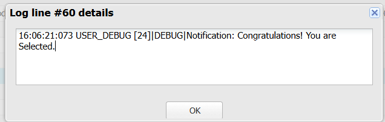
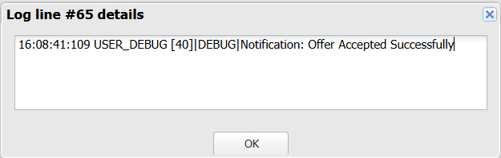

# Sprint 15 – Sending Notifications

## 📌 Sprint Objective

The objective of Sprint 15 is to automatically notify students whenever important placement events occur.

Instead of implementing notification logic inside the Apex Trigger, Salesforce delegates the responsibility to a dedicated **NotificationService**.

This architecture keeps the Trigger clean, reusable, and easy to maintain.

---

# 📖 User Story

**US-15 – Notify the Placement Office Whenever Important Placement Events Occur**

**As a** Placement Officer,

**I want** notifications to be sent automatically whenever important placement events occur,

**So that** students receive timely updates regarding their placement process.

---

# 🎯 Learning Outcomes

After completing this sprint, I learned to

- Understand After Update Trigger.
- Delegate notification logic to a Service Class.
- Detect changes using Trigger.new and Trigger.oldMap.
- Implement event-driven automation.
- Follow Salesforce Trigger Best Practices.
- Build reusable and maintainable Trigger architecture.

---

# 🏢 Business Requirement

Whenever an application's status changes,

Salesforce should automatically notify the student.

Possible events include:

- Interview Scheduled
- Selected
- Rejected
- Received Offer Letter
- Offer Accepted

The Trigger should only detect the event.

NotificationService should prepare and send the notification.

---

# 🏗️ Folder Structure

```text
force-app
└── main
    └── default
        ├── triggers
        │      ApplicationTrigger.trigger
        │
        └── classes
               NotificationService.cls
```

---

# ⚙️ Apex Trigger

## ApplicationTrigger.trigger

```apex
trigger ApplicationTrigger on Application__c
(before insert, after update) {

    // Sprint 13
    if(Trigger.isBefore && Trigger.isInsert){

        ApplicationService.validateApplications(Trigger.new);

    }

    // Sprint 14
    if(Trigger.isAfter && Trigger.isUpdate){

        StatisticsService.updateStatistics(
            Trigger.new,
            Trigger.oldMap
        );

    }

    // Sprint 15
    if(Trigger.isAfter && Trigger.isUpdate){

        NotificationService.sendNotifications(
            Trigger.new,
            Trigger.oldMap
        );

    }

}
```

---

# ⚙️ NotificationService.cls

```apex
public with sharing class NotificationService {

    public static void sendNotifications(

        List<Application__c> newApplications,
        Map<Id, Application__c> oldApplications

    ){

        for(Application__c app : newApplications){

            Application__c oldApp = oldApplications.get(app.Id);

            if(app.Status__c == 'Interview Scheduled' &&
               oldApp.Status__c != 'Interview Scheduled'){

                System.debug('Notification : Interview Scheduled');

            }

            if(app.Status__c == 'Selected' &&
               oldApp.Status__c != 'Selected'){

                System.debug('Notification: Congratulations! You are Selected.');

            }

            if(app.Status__c == 'Rejected' &&
               oldApp.Status__c != 'Rejected'){

                System.debug('Notification : Application Rejected.');

            }

            if(app.Status__c == 'Received offer letter' &&
               oldApp.Status__c != 'Received offer letter'){

                System.debug('Notification : Offer Letter Received.');

            }

            if(app.Status__c == 'Offer Accepted' &&
               oldApp.Status__c != 'Offer Accepted'){

                System.debug('Notification: Offer Accepted Successfully');

            }

        }

    }

}
```

---

# 🔄 Execution Flow

```text
Recruiter Updates Application Status

            │

            ▼

ApplicationTrigger

            │

            ▼

NotificationService

            │

            ▼

Compare Previous Status

            │

            ▼

Generate Notification

            │

            ▼

Debug Log / Notification Sent
```

---

# 💻 Code Explanation

## Trigger

```apex
after update
```

Runs automatically after the Application record is updated.

---

```apex
Trigger.new
```

Contains the latest values of the updated records.

---

```apex
Trigger.oldMap
```

Contains the previous values before the update.

---

## NotificationService

The service compares the previous status with the updated status.

If the status changes,

NotificationService automatically prepares the appropriate notification.

Example

```apex
if(app.Status__c == 'Selected' &&
   oldApp.Status__c != 'Selected')
```

This ensures notifications are sent only once when the status actually changes.

---

# 📸 Output 1 – Student Selected Notification

When the Application Status is changed to **Selected**, NotificationService executes automatically and generates the following Debug Log.

```text
Notification: Congratulations! You are Selected.
```



### Observed Result

- Trigger executed successfully.
- NotificationService detected the status change.
- Student Selected notification generated successfully.

---

# 📸 Output 2 – Offer Accepted Notification

When the Application Status is updated to **Offer Accepted**, NotificationService executes automatically.

```text
Notification: Offer Accepted Successfully
```



### Observed Result

- Trigger executed successfully.
- NotificationService detected Offer Accepted.
- Offer Accepted notification generated successfully.

---

# 🚀 Challenges Faced

- Understanding After Update Trigger.
- Using Trigger.oldMap.
- Detecting status changes.
- Delegating notification logic to NotificationService.
- Reading Debug Logs.

---

# 📚 Key Learnings

- Apex Trigger
- After Update Trigger
- Trigger.new
- Trigger.oldMap
- NotificationService
- System.debug()
- Event-Driven Programming
- Separation of Concerns
- Clean Architecture

---

# 📝 Engineering Principle

> Components should know only what they need to know.

The Trigger only knows **when** an event occurred.

NotificationService knows **how** notifications are generated.

This separation improves readability, maintainability, and future scalability.

---

# ✅ Sprint Outcome

Successfully implemented **Sprint 15** by developing an **After Update Apex Trigger** that automatically responds to important placement events.

The Trigger delegates notification processing to **NotificationService**, which generates notifications for events such as **Selected** and **Offer Accepted**.

This implementation follows Salesforce best practices by keeping the Trigger lightweight while placing business logic inside a dedicated Service Class.
