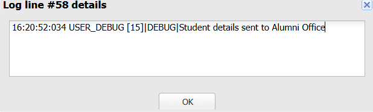

# Sprint 16 – Preparing for Tomorrow's Requirements

## Sprint Objective

The objective of Sprint 16 is to design a Trigger architecture that supports future business requirements without modifying existing Trigger logic.

Instead of rewriting the Trigger whenever a new requirement is introduced, Salesforce delegates the responsibility to a new specialized `AlumniService`.

This approach keeps the application modular, reusable, and maintainable.

---

# User Story

**US-16 – Ensure Business Logic Remains Inside Service Classes**

**As a** Placement Officer,

**I want** new business requirements to be implemented without changing the existing Trigger,

**So that** the Placement Management System remains scalable and maintainable.

---

# Learning Outcomes

After completing this sprint, I learned to:

- Extend existing Trigger architecture.
- Create a new Service Class.
- Reuse existing Trigger logic.
- Follow Separation of Concerns.
- Build scalable enterprise applications.
- Understand maintainable software architecture.

---

# Business Requirement

Whenever a student accepts an offer,

Salesforce should automatically send the student's details to the Alumni Office.

The Trigger should only recognize the business event.

`AlumniService` should perform the required business operation.

---

# Folder Structure

```text
force-app
└── main
    └── default
        ├── triggers
        │      ApplicationTrigger.trigger
        │
        └── classes
               AlumniService.cls
               AlumniServiceTest.cls
```

---

# Apex Trigger

## ApplicationTrigger.trigger

```apex
trigger ApplicationTrigger on Application__c
(before insert, after update) {

    // Sprint 13

    if(Trigger.isBefore && Trigger.isInsert){

        ApplicationService.validateApplications(
            Trigger.new
        );

    }

    // Sprint 14

    if(Trigger.isAfter && Trigger.isUpdate){

        StatisticsService.updateStatistics(
            Trigger.new,
            Trigger.oldMap
        );

    }

    // Sprint 15

    if(Trigger.isAfter && Trigger.isUpdate){

        NotificationService.sendNotifications(
            Trigger.new,
            Trigger.oldMap
        );

    }

    // Sprint 16

    if(Trigger.isAfter && Trigger.isUpdate){

        AlumniService.sendToAlumniOffice(
            Trigger.new,
            Trigger.oldMap
        );

    }

}
```

---

# AlumniService.cls

```apex
public with sharing class AlumniService {

    public static void sendToAlumniOffice(

        List<Application__c> newApplications,
        Map<Id, Application__c> oldApplications

    ) {

        for(Application__c app : newApplications){

            Application__c oldApp = oldApplications.get(app.Id);

            if(app.Status__c == 'Offer Accepted' &&
               oldApp.Status__c != 'Offer Accepted'){

                System.debug('Student details sent to Alumni Office');

            }

        }

    }

}
```

---

# Execution Flow

```text
Student Accepts Offer

        │

        ▼

ApplicationTrigger

        │

        ▼

AlumniService

        │

        ▼

Compare Previous Status

        │

        ▼

Send Student Details To Alumni Office

        │

        ▼

Generate Debug Log
```

---

# Code Explanation

## Trigger

```apex
after update
```

Runs automatically after the Application record is updated.

---

```apex
Trigger.new
```

Contains updated Application records.

---

```apex
Trigger.oldMap
```

Contains previous values before update.

---

## AlumniService

The service compares the previous status with the updated status.

```apex
if(app.Status__c == 'Offer Accepted' &&
   oldApp.Status__c != 'Offer Accepted')
```

Only when the status changes to **Offer Accepted**, AlumniService executes automatically.

---

# Output

## Application Status

```
Offer Accepted
```

↓

Developer Console Debug Log



### Debug Output

```
Student details sent to Alumni Office
```

### Observed Result

- Application status updated successfully.
- Trigger executed automatically.
- AlumniService detected the status change.
- Student details were sent to the Alumni Office.
- Debug log confirms successful execution of Sprint 16.

---

# Challenges Faced

- Understanding Trigger architecture.
- Extending existing automation.
- Creating a dedicated Service Class.
- Maintaining Separation of Concerns.
- Understanding Trigger.new and Trigger.oldMap.

---

# Key Learnings

- Apex Trigger
- After Update Trigger
- Trigger.new
- Trigger.oldMap
- AlumniService
- Event-Driven Programming
- Service Layer Architecture
- Clean Architecture
- Separation of Concerns

---

# Engineering Principle

A Trigger should coordinate business events rather than implement business logic.

New requirements should be implemented by creating new Service Classes instead of modifying existing Trigger logic.

This design improves maintainability, readability, and scalability.

---

# Outcome

Successfully implemented Sprint 16 by extending the existing Trigger architecture with a dedicated `AlumniService`.

The Trigger remains lightweight and reusable, while AlumniService independently handles the Alumni Office requirement whenever an application status changes to **Offer Accepted**.

This implementation demonstrates a scalable enterprise design that supports future business requirements without affecting existing functionality.
