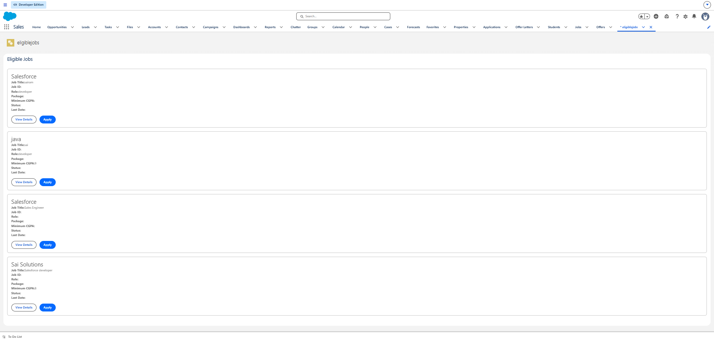
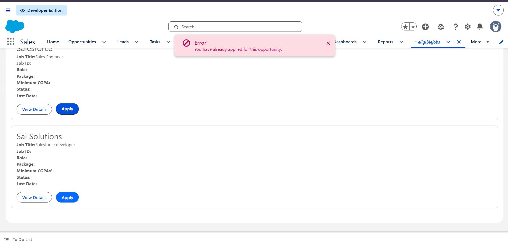

Sprint 24 – Interactive Eligible Jobs LWC (The Apply Workflow)
📌 Overview
Sprint 24 focuses on building the interactive Apply workflow for the Eligible Jobs Lightning Web Component (LWC) in the Student Placement Portal.

The implementation was completed incrementally through six tasks, starting with event handling and progressing to imperative Apex integration, state management, parent-child component refactoring, and real-time UI data refresh.

🎯 Sprint Objective
Build an interactive Apply workflow that allows students to apply for placement opportunities directly from the portal with important features such as:

Apply Action Button

Imperative Apex Execution

UI Processing States & Spinners

Prevention of Duplicate Submissions

Parent-Child Component Hierarchy (eligibleJobs & jobCard)

Clear Success and Error Handling

🔄 Development Flow
Task 1
↓
Apply Button & Event
↓
Task 2
↓
Imperative Apex Integration
↓
Task 3
↓
UI States & Double-Click Protection
↓
Task 4
↓
Parent-Child Refactoring (jobCard)
↓
Task 5
↓
Error Handling & Validation Feedback
↓
Task 6
↓
Real-Time Data Refresh & Final Workflow

🛠️ Task 1 – Implement the Apply Button & Event Handler
Objective
Create the initial Apply button in the LWC and pass the contextual jobId from HTML to JavaScript using data attributes.

Work Done
Added <lightning-button> to the job card HTML.

Configured data-job-id binding.

Implemented handleApply in JavaScript.

<lightning-button
    label="Apply"
    data-job-id={job.Id}
    onclick={handleApply}>
</lightning-button>
handleApply(event) {
    const jobId = event.target.dataset.jobId;
    console.log('Selected Job ID:', jobId);
}
Output

Result
Apply button displayed on job card

Click event successfully captured

Job ID correctly extracted via dataset

🛠️ Task 2 – Imperative Apex Integration
Objective
Call the server-side Apex application service imperatively when the user clicks the Apply button.

Concept
User Click → LWC Event Handler → Imperative Apex Call → ApplicationService → Database
import submitApplication from '@salesforce/apex/ApplicationController.submitApplication';

async handleApply(event) {
    const jobId = event.target.dataset.jobId;
    try {
        const applicationId = await submitApplication({ jobId: jobId });
        console.log('Application Created:', applicationId);
    } catch (error) {
        console.error('Submission Error:', error);
    }
}
Output

Result
Imperative Apex method connected

Backend service invoked on user action

Salesforce record created on click

🛠️ Task 3 – UI States & Double-Click Protection
Objective
Prevent duplicate application requests by disabling the Apply button and displaying loading indicators during request execution.

States Implemented
Ready: Button active [ APPLY ]

Processing: Button disabled [ SUBMITTING... ] with <lightning-spinner>

Output

Result
Double-clicks prevented

Spinner indicator displayed during async call

User experience improved with clear activity states

🛠️ Task 4 – Parent-Child Component Refactoring (jobCard)
Objective
Refactor the monolithic component by creating a dedicated child component (jobCard) to isolate card UI responsibilities.

Architecture
Parent (eligibleJobs): Fetches job lists, handles state, executes Apex calls.

Child (jobCard): Renders individual job card UI, exposes @api job, and dispatches custom events.

// Child: jobCard.js
const event = new CustomEvent('apply', {
    detail: { jobId: this.job.Id }
});
this.dispatchEvent(event);
<!-- Parent: eligibleJobs.html -->
<template for:each={jobs} for:item="job">
    <c-job-card key={job.Id} job={job} onapply={handleApply}></c-job-card>
</template>
Output

Result
Modular LWC structure achieved

Downward data flow (@api) verified

Upward communication (CustomEvent) verified

🛠️ Task 5 – Error Handling & Validation Feedback
Objective
Intercept backend exceptions (e.g., duplicate applications or passed deadlines) and display friendly toast/message UI states.

Error Handling Matrix
Scenario	System Error	User Feedback
Duplicate Application	DUPLICATE_VALUE	You have already applied for this opportunity.
Expired Deadline	VALIDATION_EXCEPTION	Applications for this job are now closed.
Output

Result
User-friendly error messaging active

System exceptions masked safely

Toast notifications integrated

🛠️ Task 6 – Real-Time Data Refresh & Final Workflow
Objective
Refresh wired job data post-submission so the screen reflects the latest database state without a page reload.

Flow
Apply Success → DML Complete → refreshApex / Notify LDS → UI Re-evaluates → Status Updated
Output

Result
Stale data eliminated via Apex refresh

Real-time UI synchronization verified

Complete end-to-end Apply flow finalized

📊 Sprint 24 Task Summary
Task	Main Work	Output
Task 1	Apply Button & Event Handler	Click event capturing jobId
Task 2	Imperative Apex Integration	Server-side submitApplication execution
Task 3	UI States & Double-Click	Disabled buttons and spinner indicators
Task 4	Parent-Child Refactoring	Modular jobCard child component
Task 5	Error Handling & Feedback	Toast alerts for duplicate/deadline checks
Task 6	Real-Time Data Refresh	Dynamic UI update post-submission
🔄 Complete Architecture
Student
  ↓
jobCard LWC (Child)
  ↓ CustomEvent ('apply')
eligibleJobs LWC (Parent)
  ↓ Imperative Call
ApplicationController (Apex)
  ↓
ApplicationService
  ↓ Validates Rules
DML / SOQL
  ↓
Salesforce Database
  ↓
UI Refresh & Toast Notification
🧩 Technologies Used
Salesforce Lightning Web Components (LWC)

HTML Template Directives

JavaScript ES6 (Promises & async/await)

Imperative Apex & @AuraEnabled

LWC Custom Events (CustomEvent)

Component Communication (@api)

Toast Notifications (ShowToastEvent)

Salesforce Developer Edition & VS Code

🐛 Challenges Faced
Double Submission on Rapid Clicks

Issue: Users could double-click Apply before the server responded, creating redundant execution calls.

Solution: Managed a local isProcessing property to disable controls immediately on click.

Stale UI State Post-Submission

Issue: Application succeeded in the database, but UI still allowed re-applying.

Solution: Triggered server data refresh (refreshApex) after successful DML execution.

Handling Child-to-Parent Event Data

Issue: Parent did not receive the jobId parameter from the child card.

Solution: Bundled data in the detail object of CustomEvent (detail: { jobId: this.job.Id }).

💡 Reflections
Separation of Concerns: Business logic belongs in backend Apex service layers, not in JavaScript handlers.

User Experience Matters: Clear states (loading, success, error) give users confidence during system actions.

Modular Architecture: Splitting components into parent-child relationships keeps code clean and maintainable.

🎯 Interview Preparation
When do you use imperative Apex over @wire?

Use imperative Apex when executing server calls in response to explicit user actions (e.g., clicking a button). Use @wire for passive, reactive data reading.

How do child components pass data to parents?

Child components dispatch custom events containing data payloads in the detail property.

How do you prevent duplicate submissions in LWC?

Disable action elements immediately upon event capture and re-enable them only after promise completion.

🏆 Sprint 24 Final Outcome
Task 1 → Task 2 → Task 3 → Task 4 → Task 5 → Task 6 → Sprint 24 Completed ✅
