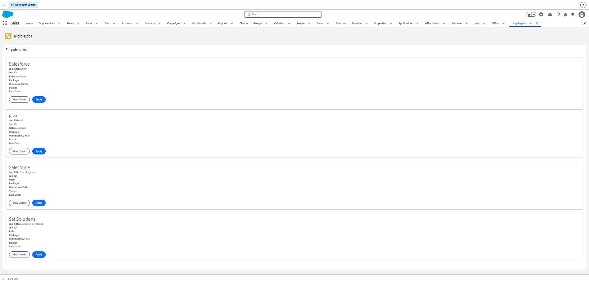
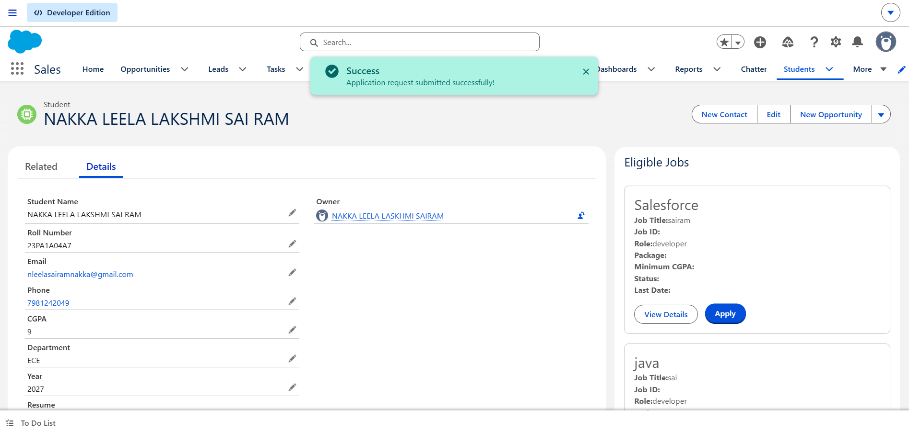
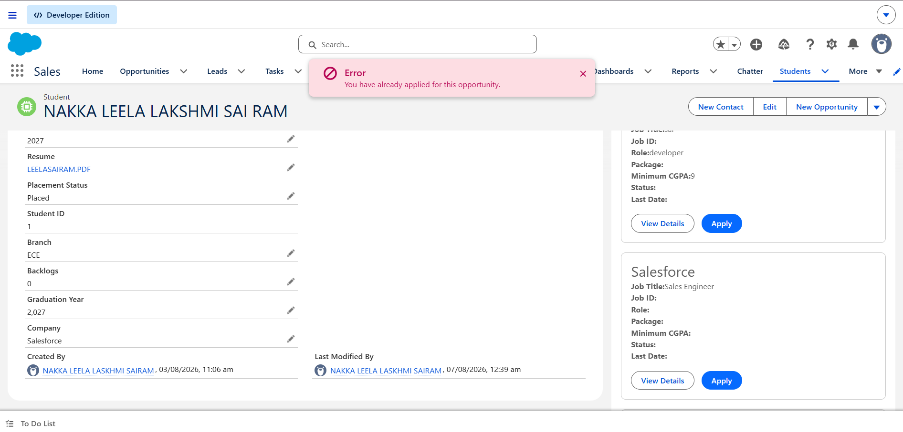

Sprint 25 – LWC Component Communication and Application Demo

📌 Overview

Sprint 25 focuses on practical Lightning Web Component development using component communication and an interactive application workflow.

The implementation demonstrates three complete scenarios:

Eligible Jobs Demo

Successful Application Demo

Failed Application Demo

The main component structure is:

eligibleJobs (Parent)
        ↓
      @api
        ↓
jobCard (Child)
        ↓
  CustomEvent
        ↓
eligibleJobs (Parent)
        ↓
Application Processing
       /       /    Success   Failure

🎯 Sprint Objective

Build a practical LWC workflow that demonstrates:

Parent-to-child communication using @api

Child-to-parent communication using CustomEvent

Reusable jobCard component

Eligible job display

Apply action

Successful application handling

Failed application handling

Clear frontend feedback

Salesforce Apex integration

🔄 Sprint 25 Development Flow

Eligible Jobs
     ↓
jobCard Component
     ↓
Parent → Child Communication
     ↓
Apply Event
     ↓
Child → Parent Communication
     ↓
Application Processing
     ↓
   ┌───────────────┐
   ↓               ↓
SUCCESS          FAILURE
   ↓               ↓
Success Toast    Error Toast

🛠️ Demo 1 – Eligible Jobs

Objective

Display eligible placement opportunities using the eligibleJobs parent component and reusable jobCard child component.

Component Flow

eligibleJobs
     ↓
job={job}
     ↓
jobCard
     ↓
Display Job Information

Parent HTML

<template for:each={jobs} for:item="job">

    <c-job-card
        key={job.Id}
        job={job}
        onapply={handleApply}>
    </c-job-card>

</template>

Child JavaScript

import { LightningElement, api } from 'lwc';

export default class JobCard extends LightningElement {

    @api job;

    handleApply() {

        const applyEvent = new CustomEvent('apply', {
            detail: {
                jobId: this.job.Id
            }
        });

        this.dispatchEvent(applyEvent);
    }
}

Expected Output

=====================================
          ELIGIBLE JOBS
=====================================

Company: Google
Job Title: Software Engineer
Job ID: JOB001
Role: Developer
Package: 12 LPA
Location: Hyderabad
Status: Open

[ View Details ] [ Apply ]

Company: Microsoft
Job Title: Salesforce Developer
Job ID: JOB002
Role: Salesforce Developer
Package: 10 LPA
Location: Bangalore
Status: Open

[ View Details ] [ Apply ]

Result

Eligible jobs displayed

Reusable jobCard component used

Job information passed from parent to child

Apply action available

📸 Demo 1 Output

🛠️ Demo 2 – Successful Application

Objective

Demonstrate the complete successful Apply workflow.

Flow

Student
   ↓
Click Apply
   ↓
jobCard
   ↓
CustomEvent
   ↓
eligibleJobs
   ↓
Job ID
   ↓
Apex
   ↓
Application Created
   ↓
Success Notification

Child Event

handleApply() {

    const applyEvent = new CustomEvent('apply', {
        detail: {
            jobId: this.job.Id
        }
    });

    this.dispatchEvent(applyEvent);
}

Parent Event Handler

handleApply(event) {

    const jobId = event.detail.jobId;

    console.log(
        'Selected Job ID:',
        jobId
    );

    submitApplication({
        jobId: jobId
    })
    .then(result => {

        console.log(
            'Application Created:',
            result
        );

        this.showToast(
            'Success',
            'Application submitted successfully!',
            'success'
        );

    })
    .catch(error => {

        console.error(
            'Submission Error:',
            error
        );
    });
}

Expected Output

┌─────────────────────────────────────┐
│              SUCCESS                │
│                                     │
│ Application submitted successfully!│
│                                     │
└─────────────────────────────────────┘

The Apply button can then display:

[ ✓ Applied ]

Result

Job ID received by parent

Application request sent to Apex

Application successfully processed

Success notification displayed

UI reflects the successful application

📸 Demo 2 Output

🛠️ Demo 3 – Failed Application

Objective

Demonstrate how the LWC handles an unsuccessful application and displays a user-friendly error message.

Example Failure Scenarios

Duplicate Application
Expired Job Deadline
Invalid Application
Backend Validation Failure

Flow

Student
   ↓
Click Apply
   ↓
jobCard
   ↓
CustomEvent
   ↓
eligibleJobs
   ↓
Apex
   ↓
Validation Failure
   ↓
Error Response
   ↓
LWC
   ↓
Error Toast

Error Handling

.catch(error => {

    let message =
        'Unable to submit application.';

    if (
        error.body &&
        error.body.message
    ) {
        message =
            error.body.message;
    }

    this.showToast(
        'Application Failed',
        message,
        'error'
    );
});

Expected Output

┌─────────────────────────────────────┐
│               ERROR                 │
│                                     │
│ You have already applied for this  │
│ opportunity.                        │
│                                     │
└─────────────────────────────────────┘

Another possible validation message:

Applications for this job are now closed.

Result

Backend failure captured

Raw technical error not directly exposed

User-friendly error message displayed

Application state remains safe

📸 Demo 3 Output

📊 Sprint 25 Demo Summary

Demo

Main Work

Output

Demo 1

Eligible Jobs

Jobs displayed with Apply action

Demo 2

Successful Application

Application created and success notification

Demo 3

Failed Application

Error handled and failure notification

🔄 Complete Architecture

Student
   ↓
eligibleJobs LWC
   ↓
jobCard LWC
   ↓
@api job
   ↓
Display Job
   ↓
Apply Button
   ↓
CustomEvent
   ↓
eligibleJobs
   ↓
Imperative Apex
   ↓
ApplicationController
   ↓
ApplicationService
   ↓
Salesforce Data
      │
      ├───────────────┐
      ↓               ↓
   Success          Failure
      ↓               ↓
Success Toast      Error Toast
      ↓               ↓
   Student           Student

🧩 Technologies Used

Salesforce Lightning Web Components (LWC)

HTML

JavaScript

@api

CustomEvent

Imperative Apex

@AuraEnabled

Apex Controller

Application Service

SOQL

DML

Toast Notifications

Salesforce Developer Edition

VS Code

Salesforce CLI

🐛 Challenges Faced

1. Passing Job Data to Child

The jobCard component needs the complete Job record from the parent.

Solution:

@api job;

Parent:

<c-job-card
    job={job}>
</c-job-card>

2. Sending Job ID Back to Parent

The parent needs to know which Job the student selected.

Solution:

const applyEvent = new CustomEvent('apply', {
    detail: {
        jobId: this.job.Id
    }
});

this.dispatchEvent(applyEvent);

The parent receives:

const jobId = event.detail.jobId;

3. Handling Successful and Failed Requests

The application can either succeed or fail because of business validation.

Solution:

.then(result => {
    // Success
})
.catch(error => {
    // Failure
});

💡 Reflections

Component Communication

I learned that LWC components should communicate through defined interfaces.

@api
Parent → Child

CustomEvent
Child → Parent

Reusable Components

The jobCard component isolates the job-card UI and can be reused for every job.

User Experience

A successful application should provide clear confirmation, while a failed application should provide a useful error message.

Separation of Responsibilities

The LWC handles the user interface and events, while Apex handles server-side processing and business rules.

🎯 Interview Preparation

What is @api?

@api exposes a public property or method that allows a parent component to communicate with a child component.

How does a child communicate with a parent?

Using CustomEvent and dispatchEvent().

What is event.detail?

event.detail contains the custom data sent by the child component.

Example:

detail: {
    jobId: this.job.Id
}

When do you use imperative Apex?

Imperative Apex is useful when Apex should execute because of an explicit user action such as clicking Apply.

How do you handle Apex errors?

Use try/catch with async/await or .catch() with Promises, then provide user-friendly feedback.

Why use a child component?

It makes the UI modular, reusable, and easier to maintain.

🚀 Deployment

Deploy the eligibleJobs component:

sf project deploy start --source-dir force-app/main/default/lwc/eligibleJobs --target-org 23pa1a04a7@cunning-badger-telyfi.com

Deploy the jobCard component:

sf project deploy start --source-dir force-app/main/default/lwc/jobCard --target-org 23pa1a04a7@cunning-badger-telyfi.com

After deployment, refresh Salesforce:

Ctrl + Shift + R

📁 Repository Structure

Sprint25/
│
├── README.md
│
├── screenshots/
│   ├── Task-1.png
│   ├── Task-2.png
│   └── Task-3.png
│
└── force-app/
    └── main/
        └── default/
            └── lwc/
                ├── eligibleJobs/
                │   ├── eligibleJobs.html
                │   ├── eligibleJobs.js
                │   └── eligibleJobs.js-meta.xml
                │
                └── jobCard/
                    ├── jobCard.html
                    ├── jobCard.js
                    └── jobCard.js-meta.xml

🏆 Sprint 25 Final Outcome

Sprint 25 demonstrates a complete interactive LWC application workflow:

Eligible Jobs
      ↓
Reusable jobCard
      ↓
Parent → Child Communication
      ↓
Apply Event
      ↓
Child → Parent Communication
      ↓
Application Processing
      ↓
   ┌───────────┐
   ↓           ↓
SUCCESS      FAILURE
   ↓           ↓
Success      Error
Toast        Toast
   ↓           ↓
Student      Student

Completed Demos

✅ Eligible Jobs Demo

✅ Successful Application Demo

✅ Failed Application Demo

Sprint 25 Completed ✅
