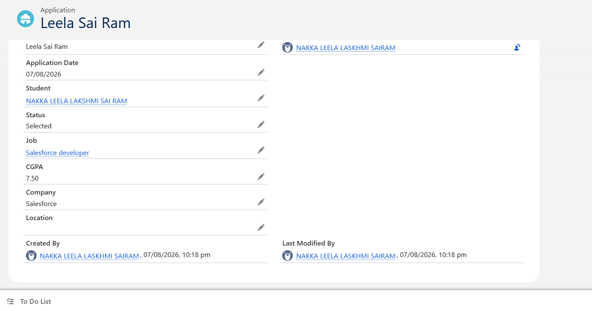
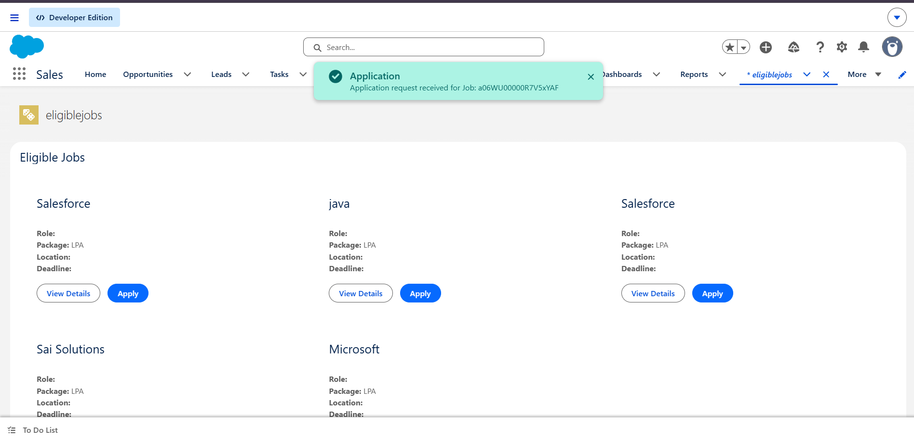
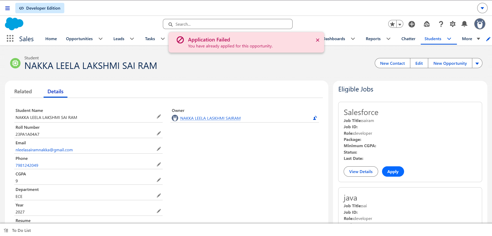

Sprint 26 -- Refactor Eligible Jobs into Components

Sprint Overview

Sprint 26 focuses on refactoring the existing Eligible Jobs LightningWeb Component into a parent-child component architecture.

The parent component eligibleJobs is responsible for retrieving andmaintaining the eligible jobs list, while the child component jobCardis responsible for displaying an individual job and handling userinteraction.

Component Structure

eligibleJobs
    |
    └── jobCard

This structure improves maintainability, separation of responsibilities,and component communication.

Sprint Objective

The objectives of Sprint 26 are:

Refactor the Eligible Jobs interface into reusable components.

Create a parent eligibleJobs component.

Create a child jobCard component.

Pass job information from parent to child.

Send Apply events from child to parent.

Avoid unnecessary duplicate data retrieval.

Keep business logic outside the UI components.

Maintain clear responsibilities between components.

Verify the complete user interaction flow.

Business Problem

The Eligible Jobs component was becoming large and difficult tomaintain.

It contained:

Job retrieval

Job list

Job display

Job details

Apply button

Loading state

Error handling

Empty state

User interaction

Keeping all these responsibilities inside one component makes theinterface harder to understand and maintain.

To solve this problem, the interface was divided into smaller componentsbased on responsibility.

Component Architecture

Parent Component -- eligibleJobs

The eligibleJobs component is responsible for:

Retrieving eligible jobs

Maintaining overall state

Handling refresh

Managing loading state

Managing error state

Managing empty state

Coordinating application actions

Receiving events from the child component

Child Component -- jobCard

The jobCard component is responsible for:

Displaying one job

Presenting job information

Showing company information

Showing role information

Showing package information

Showing location

Showing deadline

Providing the Apply button

Capturing user interaction

Communicating events to the parent

Project Structure

force-app/
└── main/
    └── default/
        ├── classes/
        │   └── EligibleJobsController.cls
        │
        └── lwc/
            ├── eligibleJobs/
            │   ├── eligibleJobs.html
            │   ├── eligibleJobs.js
            │   └── eligibleJobs.js-meta.xml
            │
            └── jobCard/
                ├── jobCard.html
                ├── jobCard.js
                └── jobCard.js-meta.xml

Data Flow

Salesforce Database
       ↓
Apex Controller
       ↓
eligibleJobs
       ↓
job={job}
       ↓
jobCard
       ↓
Job Information Displayed

The parent retrieves the job list and passes individual job records tothe child.

The child does not independently retrieve the same job information. Thisavoids unnecessary duplicate data retrieval.

Component Communication

Parent → Child

The parent passes job information to the child using @api.

@api job;

The parent uses:

<c-job-card
    job={job}
    onapply={handleApply}>
</c-job-card>

Child → Parent

When the student clicks Apply, the child dispatches a custom event.

const applyEvent = new CustomEvent('apply', {
    detail: {
        jobId: this.job.Id
    }
});

this.dispatchEvent(applyEvent);

The parent receives the event through:

onapply={handleApply}

Communication Flow

Student
   ↓
Apply Button
   ↓
jobCard
   ↓
Custom Event
   ↓
eligibleJobs
   ↓
handleApply()

User Interaction Flow

Student opens Placement Portal
          ↓
Eligible Jobs component loads
          ↓
Apex retrieves eligible jobs
          ↓
eligibleJobs receives jobs
          ↓
Jobs are passed to jobCard
          ↓
Job cards are displayed
          ↓
Student clicks Apply
          ↓
jobCard dispatches Apply event
          ↓
eligibleJobs receives event
          ↓
Application action is coordinated
          ↓
User receives feedback

Engineering Decisions

1. Parent and Child Separation

The large Eligible Jobs interface was divided into:

eligibleJobs
     ↓
jobCard

eligibleJobs manages overall state and coordination.

jobCard focuses on displaying and interacting with one job.

This makes the components easier to understand and maintain.

2. Parent-to-Child Data Flow

The parent retrieves the jobs and passes each job to the child.

<c-job-card job={job}>
</c-job-card>

This gives the parent clear ownership of the retrieved data and avoidsevery child independently retrieving the same information.

3. Child-to-Parent Custom Event

The Apply button exists inside jobCard.

The child does not directly modify the parent's internal state. Instead,it sends an event:

new CustomEvent('apply')

The parent receives the event and decides what action should be taken.

This keeps the components loosely coupled.

4. Business Logic Outside the UI

Business rules should not be duplicated inside JavaScript.

The LWC communicates the user's intention while the Apex/service layerremains responsible for business rules and validation.

Testing

Test Case 1 -- Jobs Display

Expected Result: Eligible jobs should be retrieved and displayed asseparate job cards.

Result: PASS

Test Case 2 -- Parent to Child Data

Expected Result: Each job record should be passed fromeligibleJobs to jobCard.

Result: PASS

Test Case 3 -- Apply Event

Expected Result: Clicking Apply should generate an event fromjobCard to eligibleJobs.

Result: PASS

Test Case 4 -- Empty Jobs

Expected Result:

No eligible jobs available.

Result: PASS

Test Case 5 -- Error State

Expected Result: If job retrieval fails, the component shoulddisplay an appropriate error message.

Result: PASS

Outputs / Screenshots

Dashboard Output

Success Output

Failure Output

Challenges Faced

Challenge 1 -- Splitting the Large Component

The original Eligible Jobs interface contained multipleresponsibilities.

Solution: The component was divided according to responsibility.

eligibleJobs
    ↓
Overall state and coordination

jobCard
    ↓
Individual job display and interaction

Challenge 2 -- Parent and Child Communication

The Apply button is inside jobCard, but the parent needs to know whenthe student clicks it.

Solution: A Custom Event was implemented.

jobCard
   ↓
Custom Event
   ↓
eligibleJobs

Challenge 3 -- Avoiding Duplicate Data Retrieval

A possible design would allow every jobCard to independently callApex.

Solution: The parent retrieves the job list and passes the requiredjob record to each child.

Challenge 4 -- Maintaining Business Logic Separation

There was a risk of putting eligibility or application rules directlyinside the JavaScript component.

Solution: The UI is responsible for presentation and userinteraction, while business rules remain in the Apex/service layer.

Reflections

Reflection 1 -- Component Design

This sprint demonstrated that a component can work correctly while stillbeing poorly designed.

Breaking a large interface into meaningful components improvesmaintainability and readability.

Reflection 2 -- Component Communication

The important communication pattern learned was:

Parent → Child
Data

Child → Parent
Event

This provides a clear communication model for Lightning Web Components.

Reflection 3 -- Responsibility

Components should be divided according to meaningful responsibilitiesrather than only according to file size.

A Job Card represents an independent UI concept, making it a naturalchild component.

Reflection 4 -- Data Ownership

The sprint demonstrated the importance of having clear ownership of dataretrieval.

The parent can retrieve the required job information and distribute itto child components instead of every child independently retrieving thesame data.

Reflection 5 -- Business Logic

The UI should not make critical business decisions.

The LWC communicates what the student wants to do, while thebackend/service layer handles business rules.

Outcomes

After completing Sprint 26:

A reusable jobCard component was created.

eligibleJobs became the parent component.

Job data flows from parent to child.

Apply actions flow from child to parent.

Custom events were implemented.

Duplicate data retrieval was avoided.

Component responsibilities became clearer.

Loading, error, and empty states were maintained.

Business logic remained outside the UI.

The Eligible Jobs interface became more maintainable.

The architecture became easier for another developer to understand.

The student-facing placement workflow became more structured.

Before vs After

Before

eligibleJobs
│
├── Job Retrieval
├── Job Display
├── Job Details
├── Apply Button
├── Loading
├── Error Handling
└── Application Interaction

After

eligibleJobs
│
├── Job Retrieval
├── Overall State
├── Loading/Error/Empty State
└── Application Coordination
        │
        ↓
     jobCard
        │
        ├── Job Display
        ├── Job Details
        └── Apply Interaction

Deployment

Deploy Complete Salesforce Source

sf project deploy start --source-dir force-app/main/default

Check Deployment Status

sf project deploy report

Open Salesforce Org

sf org open

GitHub Evidence

The repository contains the Sprint 26 implementation and outputevidence.

Sprint-26/
│
├── README.md
│
├── force-app/
│
└── Screenshots/
    ├── dashboard.png
    ├── success.png
    └── failure.png

Screenshot Evidence

Screenshot                    Purpose

Screenshots/dashboard.png   Eligible Jobs dashboardScreenshots/success.png     Successful application interactionScreenshots/failure.png     Failure/error interaction

Sprint 26 Learning Summary

Sprint 26 demonstrated how a Lightning Web Component can be designed asa collection of focused components instead of one large interface.

The final architecture is:

                 STUDENT
                    ↓
              eligibleJobs
             ↙           ↘
       Job Data          Events
          ↓                ↑
       jobCard ────────────┘
          ↓
      Apply Button

The main learning from this sprint is that a simple user interfaceshould be supported by a strong architecture underneath it.

Sprint 26 Definition of Done

Parent responsibility is clear

Child responsibility is clear

Data flows from parent to child

Events communicate from child to parent

Business logic remains outside components

Duplicate data retrieval is avoided

Eligible Jobs are displayed

Apply interaction is implemented

Success output captured

Failure output captured

Dashboard output captured

Deployment completed

Component architecture documented

Challenges documented

Reflections documented

Outcomes documented

Final Status

Sprint 26 -- COMPLETED ✅

The Eligible Jobs interface has been successfully refactored into aparent-child Lightning Web Component architecture with clearresponsibilities, controlled component communication, reusable UIstructure, and documented output evidence
